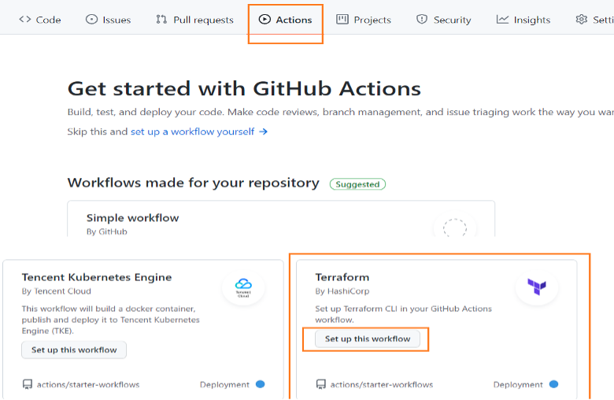
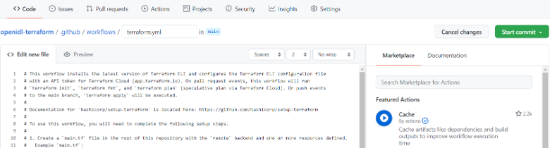

Activate GitHub Actions
-----------------------

To activate GitHub Actions for Terraform. Go to GitHub Actions sections and look for Terraform and click on setup this workflow. The reference screenshot below. 

Then commit the file terraform.yml to enable Actions. Note: This is a dummy file, and it can be removed once the entire pipeline is setup and working with branches. 

The primary GitHub repository used for infrastructure as code is mentioned below. 

GitHub repository: https://github.com/openidl-org/openidl-aais-gitops.git
