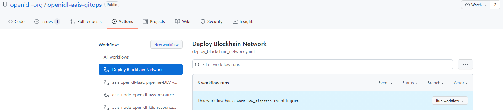
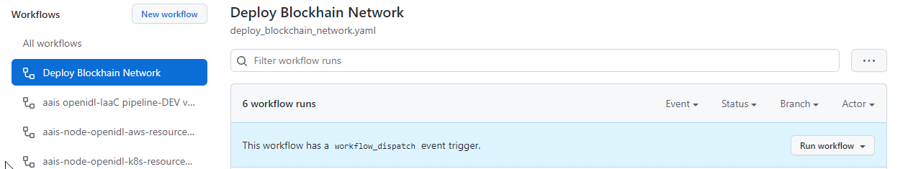
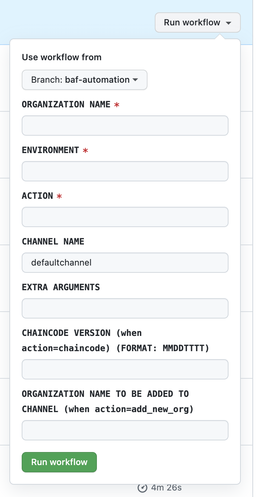

How to run GitHub Actions pipeline to update the Hyperledger Fabric Network
===========================================================================

1. Login into the “\ **openidl-aais-gitops**\ ” repository and navigate
to the Action Tab in GitHub account (reference to screenshot below)

.. image:: images2/image15.png
   :width: 6.17847in
   :height: 2.89653in

2. Click on the “Deploy Blockchain Network” workflow under the
“Workflow” section (reference to screenshot below)

3. Click on “\ **Run workflow**\ ” (reference to screenshot below)

4. “\ **Run workflow**\ ” fields

+------------------+---------------------------------------------------+
| Use workflow     | Develop branch or the branch where the workflow   |
| from             | file and its dependent files exist to be used.    |
+==================+===================================================+
| ORGANIZATION     | Organization name to use for deploying the        |
| NAME             | Blockchain network.                               |
+------------------+---------------------------------------------------+
| ENVIRONMENT      | Environment name to use for deploying the         |
|                  | Blockchain network ex: dev, stage, or prod        |
+------------------+---------------------------------------------------+
| ACTION           | Action name, refer to Section#2                   |
+------------------+---------------------------------------------------+
| CHANNEL NAME     | By default, the value of this field is set to     |
|                  | “defaultchannel”. It can be changed as per        |
|                  | requirements.                                     |
+------------------+---------------------------------------------------+
| EXTRA ARGUMENTS  | If there are any Extra Arguments need to be       |
|                  | passed while running the pipeline                 |
+------------------+---------------------------------------------------+
| CHAINCODE        | Version of the chaincode that needs to be         |
| VERSION          | installed (Format: MMDDTTTT)                      |
+------------------+---------------------------------------------------+
| ORGANIZATION     | This is required when action is ‘add_new_org’     |
| NAME             |                                                   |
+------------------+---------------------------------------------------+

5. Once the required arguments are updated in the dialog box, click on
the button “Run workflow” which will start the workflow.

GitHub Actions list for setting the blockchain network and components
---------------------------------------------------------------------

1.  **baf_image** – This action will build the baf docker image and push
    it to the “ghcr.io” registry

2.  **vault** – This action will deploy the vault cluster, unseal vault
    cluster, create secret paths inside vault for storing crypto
    material, add users and paths for config, kvs

3.  **deploy_network** - This action will create a pod to setup flux and
    deploy the Blockchain network with CA, Peer, Orderers and create the
    channel, joins the peers to channel and updates channel with anchor
    peer.

4.  **chaincode:** This action will create a pod to install the
    chaincode on the peers, approve the chaincode on a channel, commit
    the chaincode on a channel, invoke the chaincode on the channel.
    This action should be executed per channel by each organization.
    Chaincode version should be passed as an input.

5.  **join_peer** - This action will create a pod to join peers to the
    channel. This action will only be performed by analytics and carrier
    organizations after the completion of add_new_org action by aais to
    add respective organizations.

6.  **register_users** – This action is used to preregister the
    application users on CA.

7.  **add_new_channel** - This action will create a pod to create new
    channel. Prior to executing this step, make sure new channel
    information is added to organization configuration file.

8.  **add_new_org** - This action will create a pod to add the new
    organization to consortium. Prior to executing this step, make sure
    to add organization name and its domain under organizations section
    in organization configuration file.

9.  **new_org** - This action will create a pod to setup flux and deploy
    a new organization with CA and Peers on the network. Org Credentials
    and MSP definition will be uploaded to the vault.

10. **reset** - This action will reset the Blockchain network

11. **health_check** - This is sample action to perform health check

12. **vault_cleanup** – This action is used to cleanup vault when
    applicable

