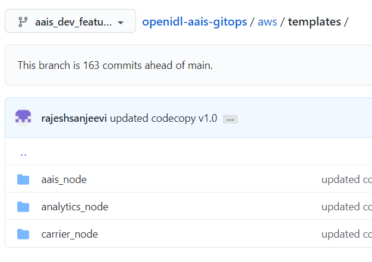
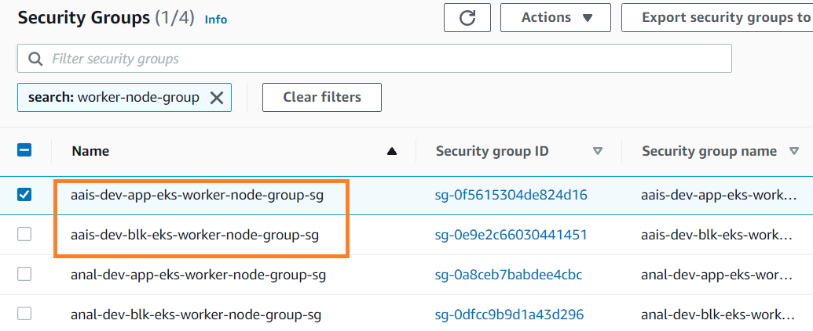

Prepare pipeline and submit
===========================

The resources required for a node are provisioned using two GitHub
actions pipeline as described below.

1. A GitHub actions pipeline to provision core AWS resources.

2. A GitHub actions pipeline to provision core Kubernetes resources and
relevant Route53 hosted zones setup

**Note**: The second pipeline is dependent on the first pipeline and
hence the first pipeline needs to be executed and it should provision
all AWS resources successfully before executing the second pipeline.

The first pipeline is used to provision all the base core AWS resources
including Kubernetes clusters and the second pipeline is used to
provision all relevant Kubernetes resources and its related Route 53
setup. The reason for this is the way terraform handles resource
dependency and to tackle issues in connecting to Kubernetes. Refer to
the below link for the details if you are interested to know more.

https://registry.terraform.io/providers/hashicorp/kubernetes/latest/docs

.. image:: images/image40.png
   :width: 5.77014in
   :height: 1.76458in

Let us ensure the below prerequisites are already setup before
configuring the pipeline and trigger them.

1. GitHub repository and its relevant configuration

2. AWS IAM user

3. AWS IAM role

4. S3 bucket for terraform state files

5. S3 bucket for terraform input files

6. DynamoDB table for terraform state file locking for AWS resources

7. DynamoDB table for terraform state file locking for K8s resources

8. Verified email address in SES and its ARN if applicable

9. All required sensitive data as environmental secrets in GitHub under
appropriate environment based on the relevant branch, node type and
environment

10. SES moved out of sandbox if applicable

1. Clone the relevant branch according to node type and its environment.
Example: aais_dev for aais node for dev environment (this could be dev
to aais_dev)

#> git clone https://github.com/openidl-<org>/openidl-aais-gitops.git

2. Create a feature branch out of the base branch with appropriate
naming standards to ensure it supports GitHub actions pipeline. The
format for feature branches should follow <base_branch>\*

**Example:** aais_dev_feature for aais_dev base branch.

3. Clone the repository and checkout the feature branch

Setup and execute the first pipeline
------------------------------------

The first pipeline triggers when the update is pushed to feature branch
and pull request is submitted, however there should be some
change/update to the following files and directories

I) aws/aws_resources/\*

II) aws/tf_s3_backend/aws_resources

1. Go to directory aws/tf_s3_backend/ and update the terraform backend
configuration file named “aws_resources”.

..

    #The below config declaration is applicable when using remote backend as S3 in terraform

    #This is the backend configuration required to setup for the first pipeline used to setup AWS resources

    bucket               = "<s3_bucket_name_for_aws_resources_pipeline>"

    key                  = "aws/terraform.tfstate"

    region               = "<aws_region>"

    encrypt              = true

    workspace_key_prefix = "env"

    ##################reference example: https://dynamodb.us-east-1.amazonaws.com#################

    dynamodb_endpoint    = "https://dynamodb.<aws_region>.amazonaws.com"

    dynamodb_table       = "<dynamodb_table_name_setup>"

    role_arn             = "<IAM_role_arn>"

    session_name         = "terraform-session"

    external_id          = "<external_id>" #external id setup during IAM user and role setup for access

2. Go to aws/aws_resources directory and activate backend as S3 in main.tf file

3. Go to aws/aws_resources directory and activate code snippet relevant to git_actions and disable code snippet relevant to Jenkins in providers.tf

4. After updating backend configuration for the pipeline, the next step is to prepare the input file and upload to S3 bucket. Refer to directory aws/templates directory prepare the terraform input file.

1. Prepare the input file according to the node prepared to setup and
   upload to the S3 bucket which is setup to manage terraform input
   files.

..

   **Note:** Each node and its environment (dev/test/prod) will have
   individual S3 Backend resources

   Refer to templates or appendix section in this document on details of
   contents in input file.

+-------------------------------------------------+--------------------+
| Path                                            | Input file         |
+-------------------------------------------------+--------------------+
| S3://<bucket_name>/                             | aais.tfvars        |
+-------------------------------------------------+--------------------+
| S3://<bucket_name>/                             | carrier.tfvars     |
+-------------------------------------------------+--------------------+
| S3://<bucket_name>/                             | analytics.tfvars   |
+-------------------------------------------------+--------------------+

2. The below are short description of each input that are required to
   setup in the input file.

    .. csv-table:: variables
        :file: table4.csv
        :header-rows: 1

..

   5. Upon compiling all the necessary inputs, save the file with proper
   naming standard. Note that the file name should be based on node_type
   as below

+-------------------------------+--------------------------------------+
| **Node Type**                 | **File Name**                        |
+-------------------------------+--------------------------------------+
| aais                          | aais.tfvars                          |
+-------------------------------+--------------------------------------+
| carrier                       | carrier.tfvars                       |
+-------------------------------+--------------------------------------+
| analytics                     | analytics.tfvars                     |
+-------------------------------+--------------------------------------+

8.  Upload the input file to S3 bucket that will manage terraform input
    files

9.  Once input file is uploaded to S3, push the updated code to feature
    branch in GitHub

10. Submit a pull request to trigger the GitHub actions pipeline to
    perform terraform plan

11. Review and approve by submitting merge request which will further
    trigger the pipeline again to perform terraform apply to provision
    all AWS resources which are part of first pipeline

12. Finally review the results and capture the outputs that is resulted
    out of terraform apply

..

   **NOTE:**

   1. Direct push to the base branch will trigger the pipeline to deploy
   and hence direct pushes should be restricted as a best practice and
   always submit pull request via feature branch approach.

:: 

    Apply complete! Resources: 247 added, 0 changed, 0 destroyed.
    Outputs:
    app_cluster_certificate = <sensitive>
    app_cluster_endpoint = "https://990D62288F376DF77ADFFF3C86BDF27E.gr7.***.eks.amazonaws.com"
    app_cluster_name = "aais-test-app-cluster"
    app_cluster_token = <sensitive>
    app_eks_nodegroup_role_arn = "arn:aws:iam::***:role/aais-test-app-node-group"
    aws_name_servers = tolist([
    "ns-1317.awsdns-36.org",
    "ns-1752.awsdns-27.co.uk",
    "ns-230.awsdns-28.com",
    "ns-760.awsdns-31.net",
    ])
    baf_automation_user = "arn:aws:iam::***:user/aais-test-baf-automation"
    baf_automation_user_access_key = <sensitive>
    baf_automation_user_arn = "arn:aws:iam::***:user/aais-test-baf-automation"
    baf_automation_user_secret_key = <sensitive>
    blk_cluster_certificate = <sensitive>
    blk_cluster_endpoint = "https://F3C63D6BA2E393F5902A3A7A1F18BD66.gr7.***.eks.amazonaws.com"
    blk_cluster_name = "aais-test-blk-cluster"
    blk_cluster_token = <sensitive>
    blk_eks_nodegroup_role_arn = "arn:aws:iam::***:role/aais-test-blk-node-group"
    cloudtrail_s3_bucket_name = "aais-test-cloudtrail-logs"
    cognito_app_client_id = <sensitive>
    cognito_client_secret = <sensitive>
    cognito_user_pool_id = <sensitive>
    eks_admin_role_arn = "arn:aws:iam::***:role/aais-test-eks-admin"
    git_actions_admin_role_arn = "arn:aws:iam::***:role/aais-test-gitactions-eksadm"
    git_actions_iam_user = "arn:aws:iam::***:user/aais-test-gitactions-eksadm"
    git_actions_iam_user_access_key = <sensitive>
    git_actions_iam_user_arn = "arn:aws:iam::***:user/aais-test-gitactions-eksadm"
    git_actions_iam_user_secret_key = <sensitive>
    public_app_bastion_dns_name = "aais-test-app-bastion-nlb-02ce3e814b44d2ca.elb.***.amazonaws.com"
    public_app_bastion_fqdn = "app-bastion.test.demo.aaistrail.com"
    public_blk_bastion_dns_name = "aais-test-blk-bastion-nlb-b3ca1cbdec8e9c09.elb.***.amazonaws.com"
    public_blk_bastion_fqdn = "blk-bastion.test.demo.aaistrail.com"
    r53_private_hosted_zone_id = "Z0381771KQJ26J731T82"
    r53_private_hosted_zone_internal_id = "Z0897486P9UUA7P72MYT"
    r53_public_hosted_zone_id = "Z02822423RAVGXT3BB9H9"
    secret_manager_vault_secret_arn = "arn:aws:secretsmanager:***:***:secret:test-aais-vaultssssecret-Jjlg99"

Setup and execute the second pipeline 
-------------------------------------

   Once the first pipeline is completed and all the AWS resources are
   provisioned, and it is all set to trigger the second pipeline to
   provision Kubernetes resources. To do this, follow the below steps.

   1. Go to the repository on the local system which was initially
   cloned part of setting up the first pipeline

   2. Go to aws/tf_s3_backend and update terraform backend configuration
   for this second pipeline in the file named “k8s_resources”

:: 

    #The below config declaration is applicable when using remote backend as S3 in terraform
    #This backend configuration is used for 2nd pipeline to setup k8s resources 
    bucket               = "<s3_bucket_name_k8s_resources>"
    key                  = "k8s/terraform.tfstate"
    region               = "<aws_region>"
    encrypt              = true
    workspace_key_prefix = "env"
    ##################reference example: https://dynamodb.us-east-1.amazonaws.com#################
    dynamodb_endpoint    = "https://dynamodb.<aws_region>.amazonaws.com"
    dynamodb_table       = "<dynamodb_table_state_locking_k8s_resources>"
    role_arn             = "<IAM_role_arn>"
    session_name         = "terraform-session"
    external_id          = "<external_id>" #external id setup during IAM user and role setup for access role setup for access

3. Go to aws/k8s_resources and activate code snippet to keep S3 as backend

4. Go to aws/k8s_resources and update providers.tf and activate code snippet relevant to git actions and disable code relevant to Jenkins

5. Go to aws/k8s_resources and updata data.tf and activate code snippet relevant to S3 as backend and disable code relevant to TFC/TFE as backend

5. Once the mentioned updates completed, there are not any other
   updates/input file generation required as both the pipelines will be
   using the common input file which was prepared and uploaded to S3
   bucket part of setting up first pipeline.

6. Hence push the code to repository again and submit pull request to
   generate terraform plan

7. Further careful review submits merge request to get this second
   pipeline triggered this time which will provision all k8s resources.

8. Please note that, this pipeline is triggered when there is a change
   to directory/files of the below

I)  Aws/k8s_resources

II) Aws/tf_s3_backend/k8s_resources

In case this pipeline is somehow triggered before first pipeline is
successful in provisioning AWS resources, this would fail as it depends
on first pipeline.

::

    Warnings:

    - Value for undeclared variable
    - Value for undeclared variable
    - Values for undeclared variables

    To see the full warning notes, run Terraform without -compact-warnings.

    Apply complete! Resources: 19 added, 0 changed, 0 destroyed.

    Outputs:
    private_ca-aais-net_fqdn = "ca.aais-net.aais.test.demo.aaistrail.com"
    private_ca-ordererorg-net_fqdn = "ca.ordererorg-net.ordererorg.test.demo.aaistrail.com"
    private_common_fqdn = "*.aais-net.aais.test.demo.aaistrail.com"
    private_data_call_service_fqdn = "data-call-app-service.test.demo.internal.aaistrail.com"
    private_insurance_manager_service_fqdn = "insurance-data-manager-service.test.demo.internal.aaistrail.com"
    private_ordererorg_fqdn = "*.ordererorg.test.demo.aaistrail.com"
    private_vault_fqdn = "vault.test.demo.internal.aaistrail.com"
    public_app_ui_url = "openidl.test.demo.aaistrail.com"
    public_common_fqdn = "*.aais-net.aais.test.demo.aaistrail.com"
    public_data_call_service_fqdn = "data-call-app-service.test.demo.aaistrail.com"
    public_insurance_manager_service_fqdn = "insurance-data-manager-service.test.demo.aaistrail.com"
    public_ordererog_fqdn = "*.ordererorg.test.demo.aaistrail.com"
    public_utilities_service_fqdn = "utilities-service.test.demo.aaistrail.com"

The warnings could be softly ignored as this is because both the
pipeline using the same terraform input file and these are because the
second pipeline use only subset of data from the input file. Hence, they
are safe to ignore.

|note| Finally note down the outputs of first pipeline and second pipeline as
they are further required in setting up the environment.

Disable access keys and setup new access keys
---------------------------------------------

The terraform pipeline provisions three vital AWS IAM user resources. As
this is provisioned part of terraform these user access and secret keys
are in terraform state file.

The initial provisioned access keys and secret keys should not be used,
and it should be set as INACTIVE(Do not delete them). Further create new access keys and secret keys
for these users and use them.

NOTE: The name of the user has the first part truncated from the
org_name. That is “carrier” becomes “carr-dev-baf-automation” which
could cause a problem during testing if creating more than one carrier.

.. csv-table: IAM users
    :file: table5.csv
    :header-rows: 1

Remove security rule created by Kubernetes HA proxy deployment
--------------------------------------------------------------

Once AWS resources are provisioned. The following security rules from
the security groups are required to remove as they are deployed by
default by Ingress Controller deployment in Kubernetes cluster.

Refer to the following security groups to identify the rule and remove
it.

.. csv-table: Security Groups
    :file: table6.csv
    :header-rows: 1

1. Go to EC2/VPC services section in the AWS console

2. Go to Security Group section

3. Look for the security group as mentioned in the above table

3. Open the security group and look for the rule related to ICMP set
   with source 0.0.0.0/0 and remove it. The below screenshot is a
   reference. Please remove only this rule only.

..

   .. image:: images/image43.png
      :width: 6.5in
      :height: 1.11528in

4. Remove this rule from both (two) security groups as mentioned the
   table above.
