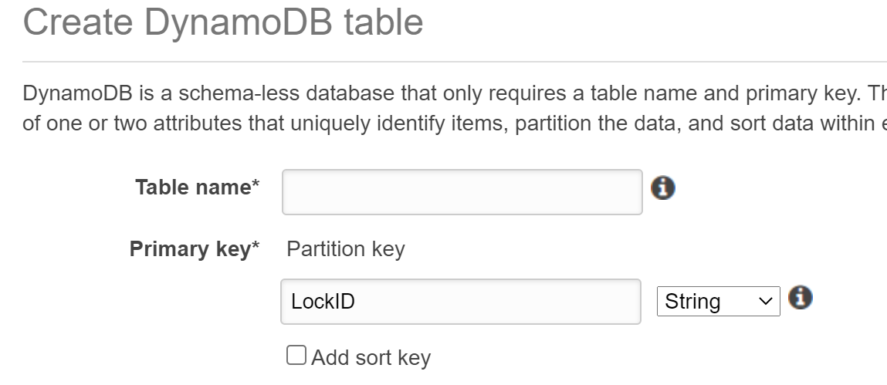
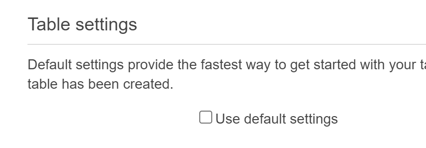
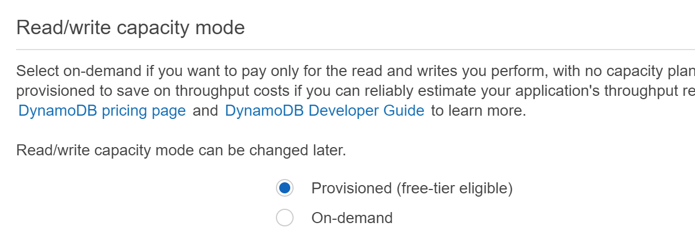
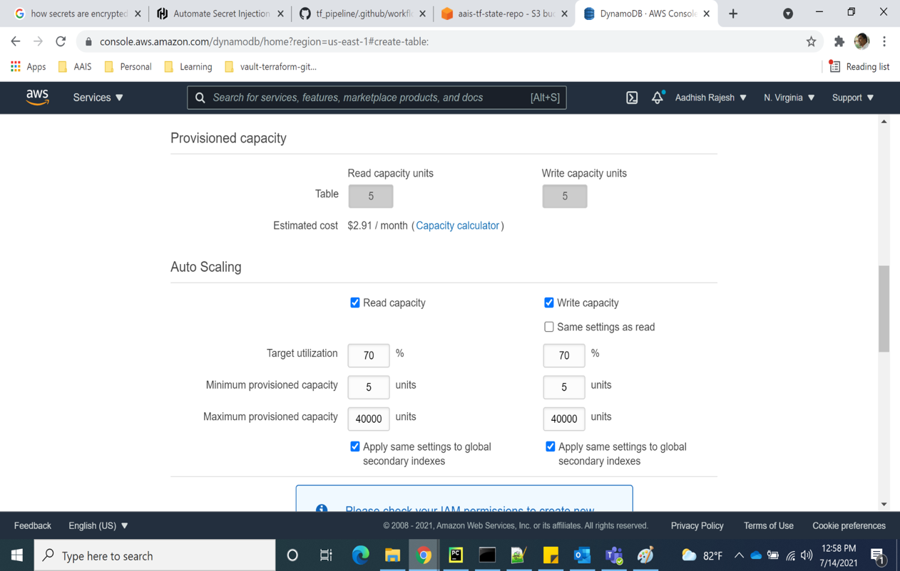

Setup terraform backend and S3 bucket (GitActions only)
=======================================================

In this section, the terraform backend resources required to manage
terraform state files and s3 bucket to store \| manage terraform input
files would be configured.

1. A S3 bucket – to manage terraform state files

2. A S3 bucket – to manage terraform input files

3. A DynamoDB table – to manage terraform state lock for AWS resources
   provisioning pipeline

4. A DynamoDB table – to manage terraforms state lock for Kubernetes
   resources provisioning pipeline.

These resources may be provisioned automated \| manual. It is
recommended to use automated approach as it is quick and simple.

Option1: Using terraform automation
-----------------------------------

1. Identify a system on which terraform CLI can be performed (checkout
   develop branch)

2. If you don’t have the terraform CLI, then install it now.

   a. Download and setup terraform CLI. refer to url:
      https://www.terraform.io/downloads.html (Install version 1.0.0)

3. Setup a local directory and clone the forked repository. It was
   forked from: (https://github.com/openidl-org/openidl-aais-gitops.git)

4. This is not the final terraform flow. Just a temporary place to
   bootstrap terraform, that will be thrown away later.

   .. image:: images/image17.png
      :width: 5.93125in
      :height: 0.88472in

5. Go to aws/tf_backend_setup directory

   .. image:: images/image18.png
      :width: 5.84514in
      :height: 1.66667in

6. Refer to terraform.tfvars.template and create terraform.tfvars input
   file. You will be preparing the following information in that input
   file.

    .. csv-table:: Terraform Variables
        :file: table-terraform-backend-variables.csv
        :header-rows: 1

7. Upon input file is prepared with necessary details, perform terraform
   initialization from the tf_backend_setup directory as below using
   command #> terraform init

   .. image:: images/image19.png
      :width: 5.04028in
      :height: 2.22431in

8. Now execute terraform plan and review the changes this terraform
   would perform in the AWS environment. #> terraform plan
   –var-file=terraform.tfvars

    .. image:: images/image20.png
        :width: 6.51181in
        :height: 3.31597in

    .. image:: images/image21.png
        :width: 6.5in
        :height: 0.87917in

9. Upon reviewing the terraform plan outcome and ensuring the action it
   would take, run terraform apply.

..

   #> terraform apply –var-file=terraform.tfvars

   .. image:: images/image22.png
      :width: 6.5in
      :height: 0.90208in

10. Review results of terraform apply and verify the resources created
    in AWS console to ensure they are all ready for GitHub actions
    pipeline.

11. Go to S3 in AWS console and validate S3 buckets are created

12. Go to DynamoDB in AWS console and validate DynamoDB table is created

13. |note| Finally note down the name of the resources provisioned and its ARN
    as they would be used further in setting up the pipeline.

..

   **NOTES**: Also, backup the terraform state file part of this
   terraform backend setup execution as they may be required in future
   to manage these resources using automation. It is recommended to
   upload in S3 bucket to a separate folder

Option2: Using AWS console (Manual) 
-----------------------------------

Step1: Setup KMS Keys
~~~~~~~~~~~~~~~~~~~~~

1. Create two KMS keys following below steps.

   1. One for S3 Buckets

   2. One for DynamoDB tables

2. First step is to setup AWS KMS key that is required to encrypt data
   in S3 bucket. Hence in AWS console go to KMS service, select
   Customer-managed keys and click on create key and select Key type as
   Symmetric and click Advanced options

    .. image:: images/image23.png

3. Select Key material origin as KMS and regionality as Single region
   key click next

    .. image:: images/image24.png

3. Give key alias name, a description and add meaningful tags.

4. Then select IAM role that was created in previous step as key
   administrators and choose to allow key administrator to delete this
   key.

    .. image:: images/image25.png

5. Again select IAM role setup in previous step for key usage
permissions and finish creating KMS key.

    .. image:: images/image26.png

Step2: Setting up S3 bucket for AWS resources & K8s resources
~~~~~~~~~~~~~~~~~~~~~~~~~~~~~~~~~~~~~~~~~~~~~~~~~~~~~~~~~~~~~

Setup two S3 bucket following below procedure. One would be used for AWS
resources provisioning and one with Kubernetes resource provisioning.

1. In AWS console, go to S3 service under buckets click on create bucket

2. Give globally a unique name to the bucket and select the specific
   region to host the bucket

   .. image:: images/image27.png
      :width: 6.09167in
      :height: 2.64375in

3. Block public access to the bucket as below

   .. image:: images/image28.png

4. Enable bucket versioning and set meaningful tags as necessary

..

   .. image:: images/image29.png
      :width: 5.83333in
      :height: 1.7875in

5. Enable server-side encryption, choose AWS Key Management Service Key
   (SSE-KMS)

6. Then from AWS KMS Key, select Choose from your AWS KMS keys and
   select AWS KMS key that was created in previous step

7. Enable Bucket Key

..

   .. image:: images/image30.png
      :width: 5.99931in
      :height: 4.65486in

8.  Finish creating the bucket. Then go to the created bucket and open.

9.  Go to permissions and click edit under bucket policy

10. Update the below bucket policy template and add it.

    .. code-block:: JSON

        {
            "Version": "2012-10-17",
            "Id": "tf_bucketpolicy",
            "Statement": [
                {
                    "Sid": "allow iam role",
                    "Effect": "Allow",
                    "Principal": {
                        "AWS": "<AWS_ROLE_ARN>"
                    },
                    "Action": [
                        "s3:GetObject",
                        "s3:PutObject"
                    ],
                    "Resource": "arn:aws:s3:::<Bucket_Name>/*"
                },
                {
                    "Sid": "Stmt1625783799751",
                    "Effect": "Allow",
                    "Principal": {
                        "AWS": "<AWS_ROLE_ARN>"
                    },
                    "Action": "s3:ListBucket",
                    "Resource": "arn:aws:s3:::<Bucket_Name>"
                }
            ]
        }

**Note**: Bucket name is name of the bucket that this policy is getting
created, role ARN is the IAM role that was created in previous step.

Step3: Setting up S3 bucket for Terraform Input file
~~~~~~~~~~~~~~~~~~~~~~~~~~~~~~~~~~~~~~~~~~~~~~~~~~~~~~~~~~~~~

1. Follow same steps of in creating S3 bucket in previous step to provision another S3 bucket for terraform input files.

Step4: Setting up DynamoDB table for AWS resources pipeline & K8s resources pipeline
~~~~~~~~~~~~~~~~~~~~~~~~~~~~~~~~~~~~~~~~~~~~~~~~~~~~~~~~~~~~~~~~~~~~~~~~~~~~~~~~~~~~

Create two DyanmoDB tables for the following.

1. For AWS resources pipeline

2. For K8s resources pipeline

3. In AWS console, go to DynamoDB service and click create table. Give a
   name to the table and set Primary Key as **“LockID”**

4. Uncheck use default settings if required and define custom
   configuration otherwise use defaults.

5. If chosen custom, define required read/write capacity

6. Define required read and write capacity units

7. Choose required encryption option for data at rest. Instead of
   DEFAULT choose KMS-Customer Managed CMK and select the KMS key
   created previously for DynamoDB.

Setup email identity and move SES out of sandbox
================================================

Cognito user pool allows users to self-sign in (self-register) using
their email id. Hence during user self-sign in process, Cognito sends
email to the user email address for verification.

These emails to users can be sent using Cognito default service or using
AWS SES service.

**Limitations:**

1. Cognito default allows only 50 emails per day only

Based on requirement, the option of either default email service
(COGNITO_DEFAULT) or SES service (DEVELOPER) shall be chosen

Option1: COGNITO_DEFAULT
------------------------

1. In case, Cognito default is preferred, there are no actions in adding
an email address and verifying it or moving SES service out of sandbox
for production used.

2. When Cognito default is chosen, set email_sending_account =
“COGNITO_DEFAULT” in input file (secrets).

3. Set the below inputs as empty in GitHub secrets as they are NA.
(These secrets must be set empty and cannot be ignored to set as empty,
otherwise GitHub actions pipeline will fail).

ses_email_identity = “”

userpool_email_source_arn = “”

Option2: AWS SES Service (DEVELOPER)
------------------------------------

1. Note that Cognito supports SES service only in the following region
though SES is available in most of the AWS regions. Hence for Cognito to
work along with SES choose either one of the regions to configure for
below steps.

**Cognito supported SES regions:**

1. us-west-1

2. us-west-2

3. us-east-1

2. In AWS console, choose one of the regions mentioned above, go to SES
service select email addresses

Login to AWS console, go to simple email service in one of the regions
and add the email address and click on verify a new email address

.. image:: images/image35.png
   :width: 6.49306in
   :height: 1.80764in

3. Enter an email address that would be used as an identity by Cognito
in sending emails to users during self-sign up.

.. image:: images/image36.png
   :width: 6.39306in
   :height: 1.975in

4. A verification email would be triggered to the email address that was
added. Please login to the email account and complete email id
verification.

5. |note| Then note down the ARN of the email address and the email address
itself that was verified in SES.

.. image:: images/image37.png
   :width: 5.95139in
   :height: 1.86458in

6. Further go to email addresses and click on the email id that is
added, then select Identity Policies and click on Create policy and
select Custom Policy.

.. image:: images/image38.png
   :width: 6.49653in
   :height: 2.66597in

7. Edit the below policy and replace account number and email-id with
the relevant values and add this policy statement to finish creating
identity policy. This allows Cognito to use SES service to trigger
emails upon user self-sign in to verify user identity.

+-----------------------------------------------------------------------+
| {                                                                     |
|                                                                       |
| "Version": "2008-10-17",                                              |
|                                                                       |
| "Statement": [                                                        |
|                                                                       |
| {                                                                     |
|                                                                       |
| "Sid": "stmnt1234567891234",                                          |
|                                                                       |
| "Effect": "Allow",                                                    |
|                                                                       |
| "Principal": {                                                        |
|                                                                       |
| "Service": "cognito-idp.amazonaws.com"                                |
|                                                                       |
| },                                                                    |
|                                                                       |
| "Action": [                                                           |
|                                                                       |
| "ses:SendEmail",                                                      |
|                                                                       |
| "ses:SendRawEmail"                                                    |
|                                                                       |
| ],                                                                    |
|                                                                       |
| "Resource":                                                           |
| "arn:aws:ses:us-east-1:<aws_account_number>:identity/<emailid>"       |
|                                                                       |
| }                                                                     |
|                                                                       |
| ]                                                                     |
|                                                                       |
| }                                                                     |
+-----------------------------------------------------------------------+

.. image:: images/image39.png
   :width: 6.49653in
   :height: 5.76111in

8. Finally follow the below link to move SES service out of sandbox for
production use.

https://docs.aws.amazon.com/ses/latest/DeveloperGuide/request-production-access.html

