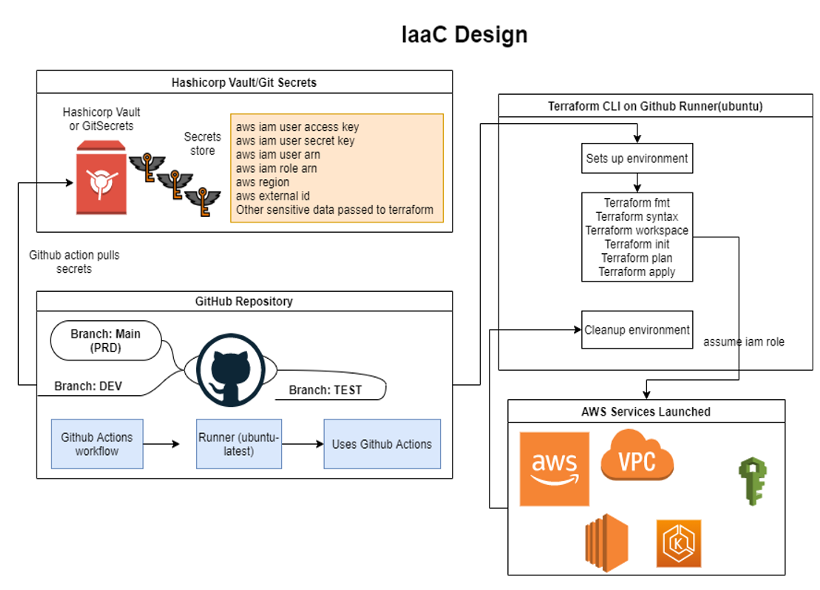
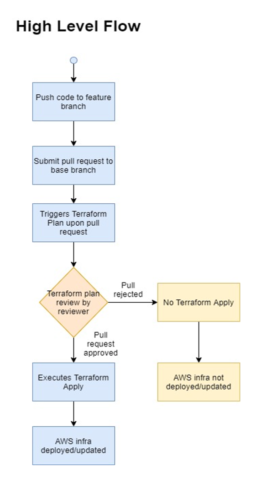

===========================================
Infrastructure as Code using GitHub Actions
===========================================

In this section we describe how to run all the Infrastructure as Code using Jenkins, Terraform Cloud or Enterprise and Ansible Tower or AWX.

|iac_design|

The overall workflow is represented in the below workflow diagram. A user pushes the code to feature branch and submits a pull request. When the pull request is submitted the GitHub actions pipeline gets triggered and runs terraform plan. 

|iac_gitactions_flow|

.. include:: iac-setup-github-repo.rst

.. include:: iac-gitactions-setup-github-repo.rst

.. include:: iac-gitactions-activate.rst

.. include:: iac-gitactions-configuration.rst

Note: 
	The naming format for any feature branch should be <base_branch_name>*
	Example: feature branch for carrier node in test environment may be: carrier_test_feature

.. include:: iac-github-bestpractices.rest

.. include:: iac-gitactions-environments.rst

.. include:: iac-prepare-aws-environment.rst

.. include:: iac-setup-user-with-inline-policy.rst

.. include:: iac-update-role-with-trust-policy.rst

.. include:: iac-gitactions-setup-terraform.rst

.. include:: iac-gitactions-setup-secrets.rst

.. include:: iac-gitactions-prepareandsubmit.rst

.. include:: iac-gitactions-references-inputs.rst

.. include:: iac-gitactions-baf.rst

.. include:: iac-gitactions-deploy-app.rst

.. include:: admin-add-application-users.rst

