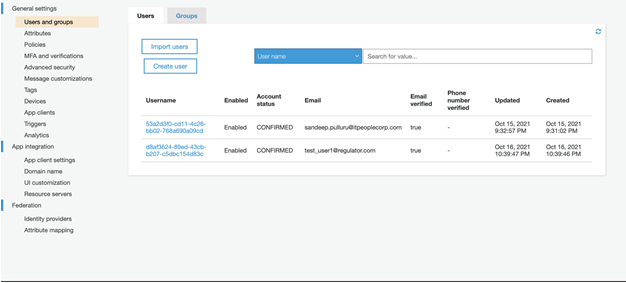
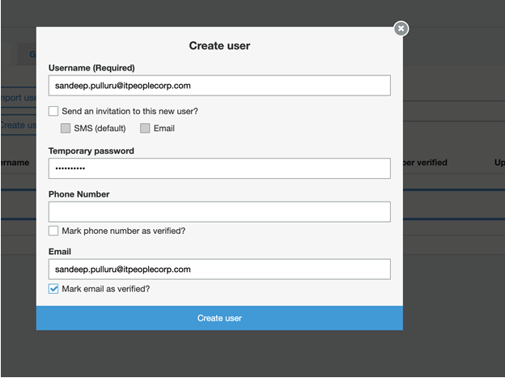
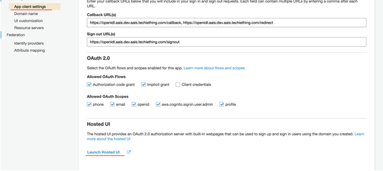
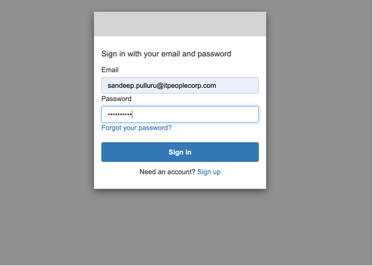
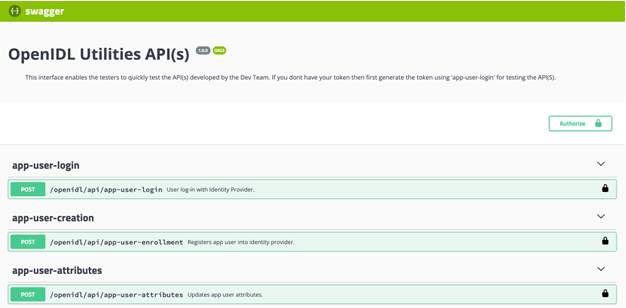

Setting up application users
============================

.. include:: icons.rst

|check|  **creating cognito admin user and application users**

After deploying application the next step is setting up the below

1. Creating Cognito admin user

2. Creating application users

Creating Admin user in Cognito
------------------------------

1.	Log into AWS Console and select the Cognito User Pool. Click on ‘Users and Groups’

2.	Select ‘Create User’ and provide the required information. See screenshot below

3.	Once the user gets created, password will need to be changed. Go to ‘App Client Settings’ and ‘Launch Hosted UI’

4.	Log-in using the credentials of the admin user which was just created

5. Change the password

|NOTE| **note down the credentials**

Creating application users
--------------------------

1.	Launch the Utilities Service Swagger at http://utilities-service ${ENV}.${ORGNAME}.${DOMAIN}.com/api-docs

    Example: https://utilities-service.dev.aais.thetech.digital/api-docs/

2.	Select ‘app-user-login’ and provide the cognito user admin credentials. Get the ‘userToken’ from response and ‘Authorize’ the user

3.	Select ‘app-user-creation’ and provide the necessary information for creating the user. Following are the examples for creating users for different organizations

+---------------------------------------------------------------------+
| AAIS Organization                                                   |
+---------------------------------------------------------------------+
|{                                                                    |
|  "users": [                                                         |
|    {                                                                |
|      "username": "liz@lazarus.com",                                 |
|      "password": "<password>",                                      |
|      "familyName": "liz",                                           |
|      "givenName": "blockchain",                                     |
|      "email": "liz@lazarus.com",                                    |
|      "attributes": {                                                |
|        "custom:stateName": "Colorado",                              |
|        "custom:stateCode": "05",                                    |
|        "custom:role": "stat-agent",                                 |
|        "custom:organizationId": "12345"                             |
|      }                                                              |
|    }                                                                |
|  ]                                                                  |
|}                                                                    |
+---------------------------------------------------------------------+

+---------------------------------------------------------------------+
| ANALYTICS Organization                                              |
+---------------------------------------------------------------------+
|{                                                                    |
|  "users": [                                                         |
|    {                                                                |
|      "username": "liz@lazarus.com",                                 |
|      "password": "<password>",                                      |
|      "familyName": "liz",                                           |
|      "givenName": "blockchain",                                     |
|      "email": "liz@lazarus.com",                                    |
|      "attributes": {                                                |
|        "custom:stateName": "Colorado",                              |
|        "custom:stateCode": "05",                                    |
|        "custom:role": "regulator",                                  |
|        "custom:organizationId": "12345"                             |
|      }                                                              |
|    }                                                                |
|  ]                                                                  |
|}                                                                    |
+---------------------------------------------------------------------+

+---------------------------------------------------------------------+
| CARRIER Organization                                                |
+---------------------------------------------------------------------+
|{                                                                    |
|  "users": [                                                         |
|    {                                                                |
|      "username": "liz@lazarus.com",                                 |
|      "password": "<password>",                                      |
|      "familyName": "liz",                                           |
|      "givenName": "blockchain",                                     |
|      "email": "liz@lazarus.com",                                    |
|      "attributes": {                                                |
|        "custom:stateName": "Colorado",                              |
|        "custom:stateCode": "05",                                    |
|        "custom:role": "carrier",                                    |
|        "custom:organizationId": "12345"                             |
|      }                                                              |
|    }                                                                |
|  ]                                                                  |
|}                                                                    |
+---------------------------------------------------------------------+

