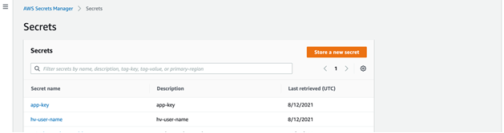
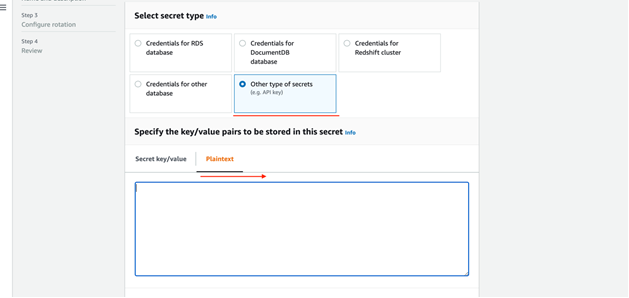
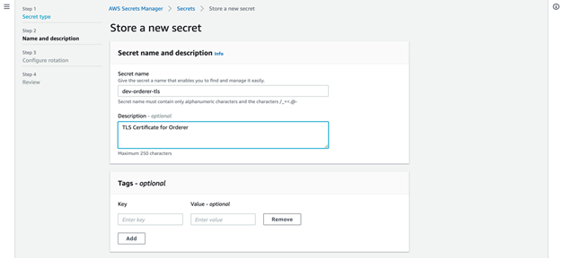

Connecting to AWS Secrets Manager
================================

.. include:: icons.rst

This section describes how to connect to AWS secrets manager to retrieve/write secrets like

#Orderer TLS certificate on Analytics or Carrier node

#Org MSP of analytics or carrier node on AAIS node

Storing Orderer TLS certificate on Analytics/Carrier Node
---------------------------------------------------------

1. Login to AWS console and go to secrets manager

2. Click on store new secret

3. Select "Other type of secrets" and use "Plaintext"

4. Set a name to the secret as "<env>-orderer-tls". Example: dev-orderer-tls

5. Disable automatic rotation and complete creating the secret

Storing Org MSP certificate on AAIS node
----------------------------------------

1. Login to AWS console and go to secrets manager

2. Click on store new secret

3. Select "Other type of secrets" and use "Plaintext"

4. Set a name to the secret as "<env>-<orgname>-msp". Example: dev-analytics-msp | dev-trv-msp | dev-carrier-msp (depends on orgname used)

5. Disable automatic rotation and complete creating the secret

