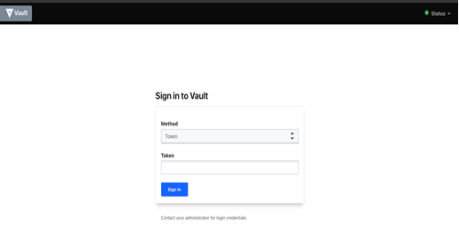
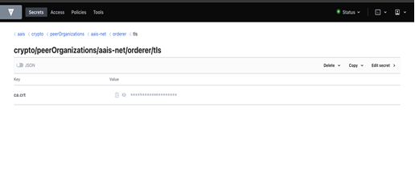
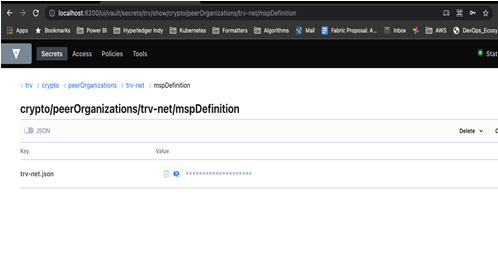

Connecting to Vault Cluster
===========================

.. include:: icons.rst

This section describes how to connect to vault cluster and further retrieve following certificates.

#Orderer TLS certificate from AAIS node (multi tenant) hashicorp vault

#Analytics/Carrier ORG MSP from hashicorp vault

Connecting to vault cluster
---------------------------

1. Setup AWS CLI profile with necessary credentials and IAM role

2. Switch to the K8s blockchain cluster context

Example: #>aws eks update-kubeconfig --region <region> --name <blockchain-cluster-name>

3. Get the vault root token from AWS secret manager to login vault

Example: #>aws secretsmanager get-secret-value --region <region> --secret-id <orgname>-<env>-vault-unseal-key

|NOTE| ** Ensure that the AWS credentials has permissions to retrieve secret from secrets manager

4. Setup port-forward using below command to access vault

#kubectl port-forward -n vault svc/vault 8200:8200

5. Login to vault using root token retrieved from AWS secret manager

Retrieve Orderer TLS certificate (AAIS Node)
--------------------------------------------

1. Orderer TLS certificate is available at the below mentioned path. Replace <orgname> with organization name (aais)

Path: http://localhost:8200/ui/vault/secrets/<orgname=aais?>/show/crypto/peerOrganizations/<orgname>-net/orderer/tls

2. Copy the orderer TLS certificate and paste into a file, Example: "orderer.pem"

3. Convert the orderer TLS certificate to base64

#cat "orderer.pem" | base64

4. Share the base64 encoded orderer TLS certificate with analytics/carrier node. This would be used during blockchain network steps

Retrieve Org MSP certificate (Analytics or Carrier Node)
--------------------------------------------------------

1. Org MSP certificate is available at the below mentioned path. Replace <orgname> with organization name (anal | trv |etc for example)

Path: http://localhost:8200/ui/vault/secrets/<orgname>/show/crypto/peerOrganizations/<orgname>-net/mspDefinition

2. Copy the Org MSP certificate and paste into a file, Example: "orgMSP.txt"

3. Share the Org MSP certificate AS-IS copied from the vault to AAIS node owner to add them in their environment as secrets.
This would be used during blockchain network steps

