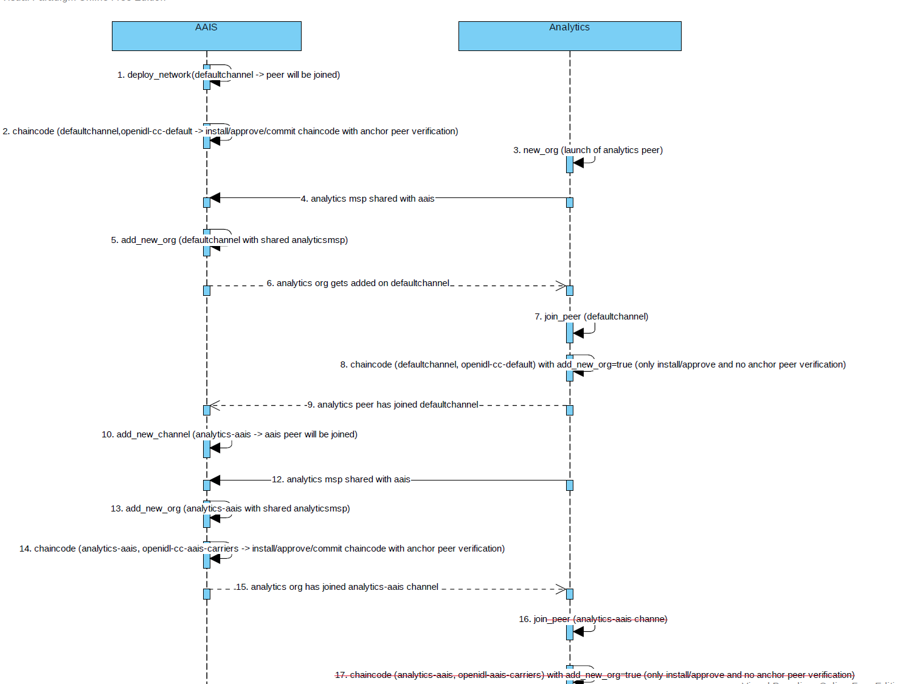
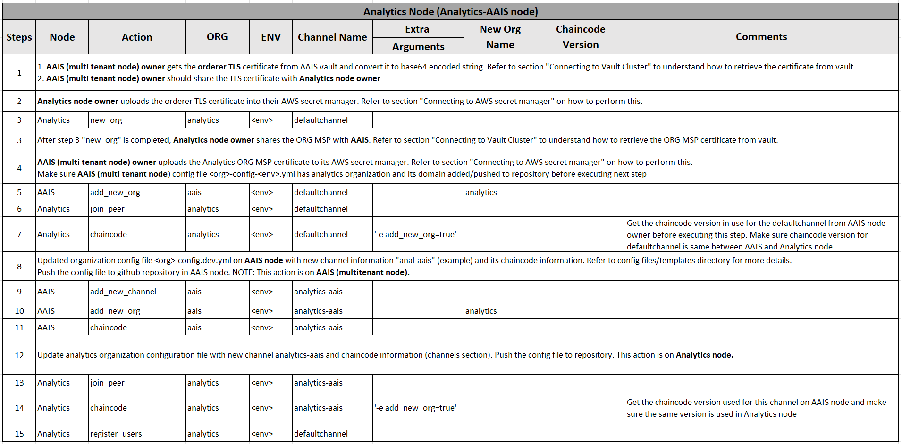
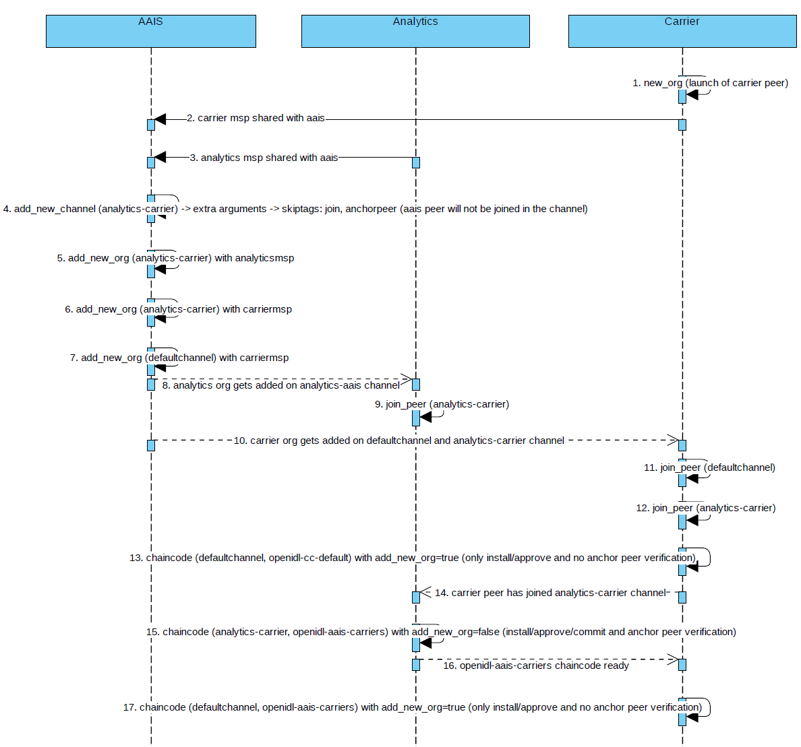
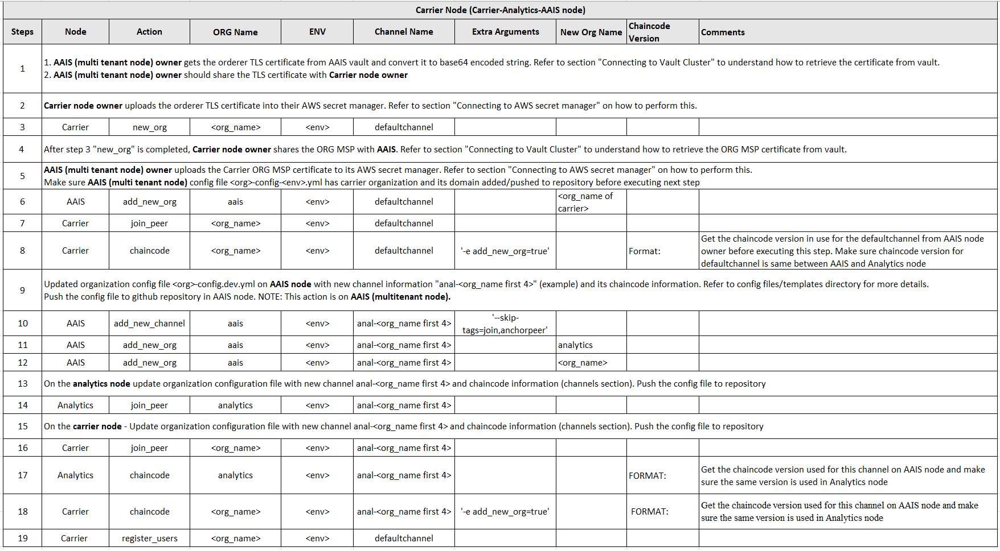

Deploy Blockchain Network
=========================

.. include:: icons.rst

The next phase is blockchain deployment phase in which the following steps are required to perform.

1. Prepare config file for blockchain network setup
2. Update OpenIDL related credentials in Ansible
3. Deploy vault
4. Deploy Blockchain Network (new network or add a node to existing network)

Preparing Config file for Blockchain network setup
--------------------------------------------------

|check| **Prepare config file for blockchain network setup**

Since the first step of provisioning base AWS infrastructure is completed, the next step would be
preparing the dependent components and setting up either blockchain network/a node to join the existing
network depends on your organization role.

The template and example configuration files are in the repository "**openidl-aais-gitops**" under
“awx-automation/config-references”. Using these templates, the actual config file can be created and
placed in the path “awx-automation/config”. The file name should follow the naming standard as below.

FileName format: <org-name>-config-<env>.yml

Org-name: Up to first 4 characters of the org name
Env: dev \| test \| prod

The configuration file should be placed in the path
“awx-automation/config/<org-name>-config-<env>.yml

NOTE: Make sure to atleast have a defaultchannel listed under channels in organization configuration file. New
channel information may be added when required in the configuration file and maintained in the repository.

Please ensure that this configuration file is prepared and exist in the mentioned directory path in the github
repository before triggering deployment jobs in Jenkins.

**NOTE:** The details in preparing the config file are to refer from the repository templates.

.. image:: images3/image65.png

After preparing the configuration file as mentioned above and ensure that it is pushed to the
github repository "**openidl-aais-gitops" used to prepare the node.

The following table details the meaningful description for the configuration file variables and their expected values.

.. csv-table:: AAIS Node Configuration
    :file: table8.csv
    :header-rows: 2

.. csv-table:: Analytics Node Configuration
    :file: table9.csv
    :header-rows: 2

.. csv-table:: Carrier Node Configuration
    :file: table10.csv
    :header-rows: 2

Update openIDL related credentials in Ansible
---------------------------------------------

|check| **Update OpenIDL relevant credentials in Ansible Tower/AWX**

The next step is critical, as if you remember while setting Ansible Tower/AWX there was a step to create credentials.
However the credentials setup was not completed 100% as there were unknown values for certain fields during
preparation phase, hence kept dummy values to create them.

Now that the base infrastructure is created, all the values would be available now to update the credentials to
be 100% ready for our pipeline jobs run smoothly without issues.

Refer to section Prepare Ansible Tower/AWX => Credentials and update the following credential type

1. OpenIDL-IAC specific
2. OpenIDL-APP specific
3. openIDL-IAC-AWSUser-BAF

Vault Deployment
----------------

It is all set to deploy vault. Go to Jenkins and to the vault deployment pipeline job created in previous step.
Click on build with parameters and key in organization name (name that was used to setup infra) and environment type
(dev \| test \| prod) and chose deploy_action whether to deploy. There is also a vault_cleanup job which would be handy in case to remove vault
for unforeseen reasons.

|NOTE| **First run after configuring the job is dummy run as the option
shows as “Build Now”. This will fail and will update your job with
relevant parameters required for the job to run. Further runs will show
an option Build with Parameters which will be right run.**

.. image:: images3/image66.png

.. _blockchain-network-job-1:

Deploy Blockchain Network
-------------------------

It is time to deploy either blockchain network (new network) or joining a node to existing network.

To run blockchain related tasks, the relevant jenkins pipeline job for blockchain should be triggered with
different actions based on workflow.

|NOTE| **First run after configuring the job is dummy run as the option
shows as “Build Now”. This will fail and will update your job with
relevant parameters required for the job to run. Further runs will show
an option Build with Parameters which will be right run.**

.. image:: images3/image67.png

Before triggering the blockchain pipeline, let us understand the workflow involved and multiple actions
that needs to be followed in sequence. Then it would be easy to follow the workflow table and trigger the
blockchain pipeline job in jenkins accordingly.

AAIS node setup
~~~~~~~~~~~~~~~

The below are the steps required to complete using relevant jenkins jobs to setup base AAIS (multi tenant node).
These steps are to be performed on AAIS (multi tenant node).

.. csv-table:: AAIS NODE
    :file: table-aais-network.csv
    :header-rows: 2

Analytics node setup
~~~~~~~~~~~~~~~~~~~~

Pictorial representation
~~~~~~~~~~~~~~~~~~~~~~~~

Analytics node workflow
~~~~~~~~~~~~~~~~~~~~~~~

The below are the steps to follow in deploying analytics node and joining with AAIS(multi tenant node). The procedure
involves performing joint action working with AAIS(multi tenant) node.

These steps are required to perform in sequential order. These steps are to be performed through blockchain pipeline job
in jenkins.

Carrier node setup
~~~~~~~~~~~~~~~~~~

Pictorial representation
~~~~~~~~~~~~~~~~~~~~~~~~

Carrier node workflow
~~~~~~~~~~~~~~~~~~~~~

The below are the steps to follow in deploying carrier node and joining with AAIS(multi tenant node)/Analytics node.
The procedure involves performing joint action working with AAIS(multi tenant) node and Analytics node.

These steps are required to perform in sequential order. These steps are to be performed through blockchain pipeline job
in jenkins.

