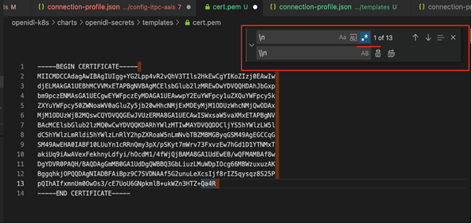
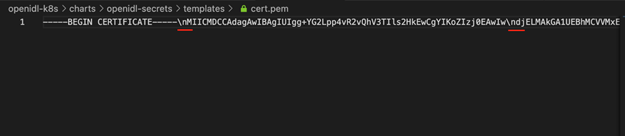

Deploy OpenIDL Application
==========================

.. include:: icons.rst

This section briefs the procedure to deploy backend database mongodb, application APIs and configuration steps to bring
the OpenIDL platform up and running for use.

The below are the steps involved

1. Deploy MongoDB

2. Prepare application API configuration files

3. Add application API configuration files to vault

3. Deploy API configuration files as secrets object in EKS cluster

4. Deploy application APIs as deployment objects in EKS cluster

5. Create admin user in AWS Cognito

6. Create application users using Utilities Service API

Deploy MongoDB
--------------

|check| **deploy mongodb instance**

1. Go to Jenkins and click on relevant MongoDB job

2. Click on Build with parameters and key in organization name and environment type

3. Choose deploy_action as "mongodb-deploy"

**Note**: First run after configuring the job is dummy run as the option
shows as “Build Now”. This will fail and will update your job with
relevant parameters required for the job to run. Further runs will show
an option Build with Parameters which will be right run.

.. image:: images3/image68.png

|NOE| In case mongodb deployment ran to issues, bug fix the issues and perform mongodb_cleaup before rerun deployment.
The deploy_action "mongodb_cleanup" helps in Jenkins job to perform cleanup.

Preparing application API configuration files
---------------------------------------------

|check| **preparing application config json files**

1. Get to the repository openidl-aais-gitops and to the directory "openidl-config/"

2. This has config-templates directory under which the set of template files are available individually for each node type (aais | analytics | carrier)

3. Update the relevant set of template config files with all correct values

4. Run #make copy_config_files to generate correct config files in to the config directory

|NOTE| **Refer to below table that describes the details of each field and the value expected from the environment provisioned**

.. csv-table:: API Configuration Fields Description
    :file: table-api-config.csv
    :header-rows: 2

Retrieving CA TLS Certificate
~~~~~~~~~~~~~~~~~~~~~~~~~~~~~

1. Go to command line

2. Set AWS_PROFILE to the relevant profile that has access to vault root token secret in AWS secret manager

    #set AWS_PROFILE=tf-automation-role (or)

    #export AWS_PROFILE=tf-automation-role

3. Retrieve vault root token from AWS secret manager

    #aws secretsmanager get-secret-value --region <region> --secret-id <orgname>-<env>-vault-unseal-key

    #example: aws secretsmanager get-secret-value --region us-east-2 --secret-id aais-dev-vault-unseal-key

4. Now set the AWS_PROFILE to the relevant profile that has access to blockchain EKS cluster

    #set AWS_PROFILE=eks-admin-role (or)

    #export AWS_PROFILE=eks-admin-role

    |NOTE| **IAM user or assume IAM role that has access to the EKS cluster**

3. Set the cluster context to blockchain cluster

    #aws eks update-kubeconfig --region <region> --name <blockchain-cluster-name>

4. Perform port-forward for vault service

    #kubectl port-forward -n vault svc/vault 8200:8200

5. Vault should be available at http://localhost:8200

6. Login to vault using root token retrieved from AWS secrets manager

7. The CA TLS certificate should be available at below path. Replace <orgname> with actual orgnaization name

    PATH: http://localhost:8200/ui/vault/secrets/<orgname>/show/crypto/peerOrganizations/<orgname>-net/ca

8. Name of the key to retrieve value from "ca.<orgname>-net-cert.pem"

    Example: ca.aais-net-cert.pem

9. Now copy this CA TLS certificate pem content into editor like "VS CODE"

10. Use replace all values, select use regular expressions (title '.*' icon on search) and replace "\n" with "\\n"

11. After replacing al, final output would look like below.

Add application API configuration files to vault
------------------------------------------------

|check| **Add application configuration json files as secrets into vault**

1. Go to command line and set AWS_PROFILE to the relevant profile that has access to EKS cluster

2. Set the cluster context to blockchain cluster

    #aws eks update-kubeconfig --region <region> --name <blockchain-cluster-name>

3. Create a local file ubuntu.yml and paste the following content in the file (this file is available in the repository
under openidl-config)

+---------------------------------------------------------+
|apiVersion: v1                                           |
|kind: Pod                                                |
|metadata:                                                |
|    name: ubuntu                                         |
|spec:                                                    |
|    containers:                                          |
|        - name: ubuntu                                   |
|          image: ubuntu:latest                           |
|          # Just spin & wait forever                     |
|          command: ['/bin/bash', '-c', '--']             |
|          args: ['while true; do sleep 30; done;']       |
+---------------------------------------------------------+

4. Create a new pod in the default namespace using the above definition

    #kubectl apply -f ./ubuntu.yml

5. Copy the config files prepared from openidl-aais-gitops/openidl-config/config/config-<env>-<node>/ directory to the pod

    #cd openidl-aais-gitops/openidl-config/

    #kubectl cp config/<config-<dev>-<node-type>/ default/ubuntu:config

    Example: kubectl cp config/config-dev-aais/ default/ubuntu:config

6. Copy pull-vault-config script to the pod

    #cd openidl-aais-gitops/vault-scripts

    #kubectl cp add-vault-config.sh default/ubuntu:add-vault-config.sh

7. Exec into the pod #kubectl exec -it ubuntu - /bin/bash

8. Update the pod and install utilties vim, curl, dos2unix, jq

    #apt-get update
    #apt-get install vim jq curl dos2unix -y

9. Check whether the files are copied correctly into the pod. You should see the file "add-vault-config.sh" under "/" directory and
application config files under "/config" directory

10. Allow execute permission to add-vault-config.sh #chmod +x add-vault-config.sh

11. In case due to copying from windows to linux has file formatting issue, run this command #dos2unix add-vault-config.sh

12. Now get the vault user login credentials from AWS secret manager that has access to config files located in vault path

13. Get onto AWS CLI, set the AWS_PROFILE to "tf-automation-role" that has access to secrets

14 Retrieve the credential using below command.

    #aws secretsmanager get-secret-value --region <region> --secret-id <orgname>-<dev>-config-vault

    Example: aws secretsmanager get-secret-value --region us-east-2 --secret-id aais-dev-config-vault

15. Now get onto the ubuntu pod and run the add-vault-script.sh with the retrieved credentials to upload config files as secrets into vault

    #./add-vault-config.sh -V <url> -U <username> -P <password> -a <vaultPath> -o <orgName> -c ./config

    #All the values for the parameters are retrieved from the secret <orgname>-<dev>-config-vault

16. After successful upload of config files as secrets in vault, delete the pod safely

    #kubectl delete pod ubuntu -n default

Prepare application API deployment value files
----------------------------------------------

|check| **Prepare application api deployment value files**

1. Go to openidl-aais-gitops/openidl-k8s directory

2. Update the deployment definition file according the node type (aais | analytics | carrier)

    #gloabl-values-dev-<node-type>.yaml

    Examples:

        global-values-dev-aais.yaml

        global-values-dev-analytics.yaml

        global-values-dev-carrier.yaml

3. Once the relevant file is prepared for the node, push it to github repository before executing deployment pipeline job

|NOTE| Work with AAIS in updating this file as they have most of the information especially image repository, image and tags.

However the below table describes brief information that benefits to some extend.

+-------------------------------------------------------------------------+
|Key Field               |Description                                     |
+-------------------------------------------------------------------------+
|ingresshostname         | <service>.<env>.<subdomain>.internal.<domain>  |
|                        |                                                |
|publicingresshostname   | <service>.<env>.<subdomain>.<domain>           |
|                        |                                                |
|image.repository        | Get the repository and image from AAIS         |
|                        |                                                |
|image.tag               | Get the image tag from AAIS                    |
+-------------------------------------------------------------------------+

Deploy config files as secret object to EKS application cluster & Deploy application APIs
-----------------------------------------------------------------------------------------

|check|  **deploy secret object & application apis**

To deploy application secrets and OpenIDL application, run the job configured for OpenIDL applications. Go to Jenkins and select the relevant job and use Build with Parameters.

|NOTE| First run after configuring the job is dummy run as the option shows as “Build Now”. This will fail and will update your job with relevant parameters required for the job to run. Further runs will show an option Build with Parameters which will be right run.

This job has two step process.

    1. Perform deploy-secrets and then deploy-apps action. The first action deploys relevant configuration as Kubernetes secrets

    2. Then perform action deploy application as deployment objects in EKS cluster

.. image:: images3/image70.png

