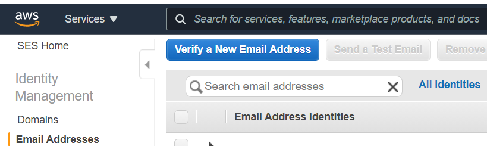
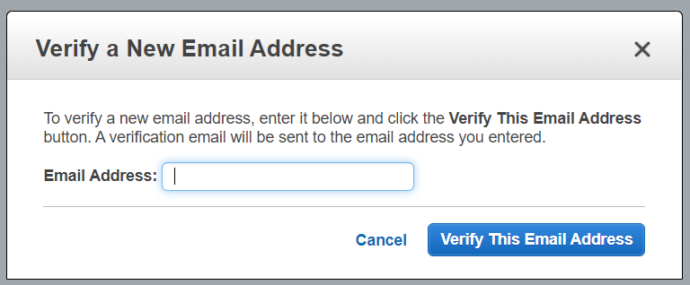
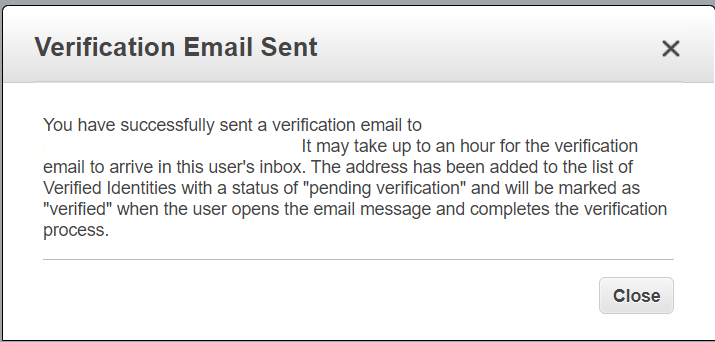
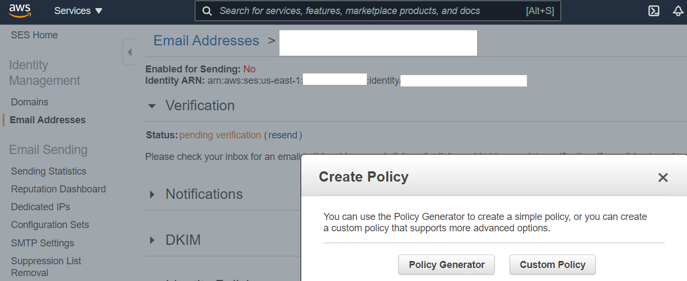
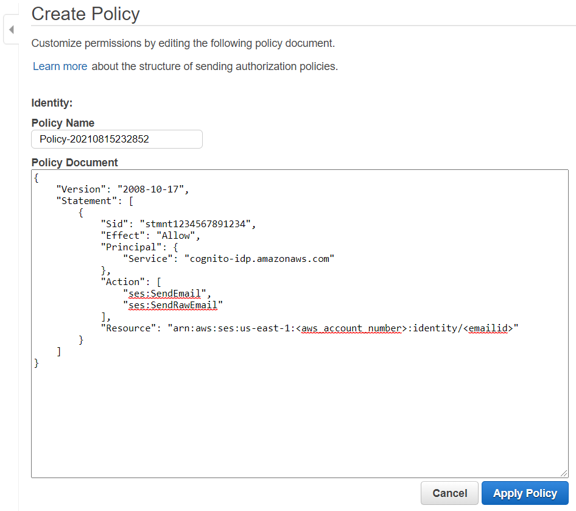

Prepare Amazon Web Services Account
==================================

.. include:: icons.rst

The AWS account needs to be prepared before the actual resources are deployed as a prerequisite.

|note| **As a first step note down the aws account number as it will be used later**

In this phase, the following steps are performed at high level.

1. Enable an IAM role with permission policy
2. Enable an IAM user
3. Enable trust policy
4. Prepare Cognito prerequisite

Setup IAM Role
--------------

|checkbox| **Setup IAM Role for terraform**

1.	Login to AWS console using either a root account or IAM user with administrative rights
2.	Go to IAM and go to roles under access management and click on create role
3.	Select type of trusted entity as “AWS account”
4.	Keep the default for the account.
5.  Choose "Require external ID" and enter "terraform".  Then click "next"

    .. image:: images/select-trusted-entity.png

6.  Then click on create policy, select json and update the policy content with below policy to limit only necessary permissions for the IAM role to be used by terraform to manage AWS resources.

    .. code-block:: JSON

        {
            "Version": "2012-10-17",
            "Statement": [
                {
                    "Sid": "AllowServices",
                    "Effect": "Allow",
                    "Action": [
                        "iam:*",
                        "ec2:*",
                        "s3:*",
                        "cloudtrail:*",
                        "cloudwatch:*",
                        "logs:*",
                        "ses:*",
                        "cognito-idp:*",
                        "eks:*",
                        "kms:*",
                        "dynamodb:*",
                        "acm:*",
                        "autoscaling:*",
                        "elasticloadbalancing:*",
                        "ebs:*",
                        "route53:*",
                        "route53domains:*",
                        "sts:*",
                        "secretsmanager:*",
                        "cloudformation:ListStacks",
                        "sns:*",
                        "application-autoscaling:*",
                        "lambda:*"
                    ],
                    "Resource": "*"
                }
            ]
        }

7. Add necessary meaningful tags which are arbitrary for the policy

   **Example:**

    Owner = “”

    Used_by = “terraform”

    Application = “openidl”

8. Enter a name for the IAM policy, ex: tf_admin_policy and click on create policy to finish

    .. image:: images/iac_aws_setup_3.png

9. Once the policy is created, go back to roles screen, and create the role again click refresh and select the named policy created in previous step and hit the refresh button.

    .. image:: images/iac_aws_setup_4.png

10. Add the necessary arbitrary tags to the IAM role this time and click Review

11. Enter role name, a description and ensure the policy is assigned as per below screen shot and click on create role to finish setting up IAM role with necessary policy required to manage AWS

    .. image:: images/iac_aws_setup_5.png

|note| **Note down the IAM role ARN as it is required later**

Setup IAM User with inline policy
---------------------------------

|checkbox| **Setup IAM user for terraform**

1. Within IAM in AWS console go to users in access management and click
   on Add users

2. Enter a username and select AWS access type as “Programmatic access”
   and click next

..

   .. image:: images/image14.png
      :width: 5.62083in
      :height: 1.66667in

3. Add user to specific group if applicable, otherwise key in tags and
   finish creating user

    **Note**: Do not attach any IAM policy at this moment.

4. Create the user

5. Note the access key id and secret key

4. Then get back to users and open the created user, go to permissions
   and click on Add inline policy, click on json

    .. image:: images/image15.png
       :width: 5.76667in
       :height: 1.49444in

5. Modify the below policy template by adding ARN of the IAM role
   created in previous step and the external id value set in previous
   step and click review policy “terraform” is the external id

    .. code-block:: JSON

        {
            "Version": "2012-10-17",
            "Statement": [
                {
                    "Action": [
                            "sts:AssumeRole",
                            "sts:TagSession"
                    ],
                    "Resource": "<AWS_IAM_ROLE_ARN>",
                    "Effect": "Allow",
                    "Condition": {
                    "StringEquals": {
                            "sts:ExternalId": "<AWS_EXTERNAL_ID>"
                        }
                    }
                }
            ]
        }

6. Finally name the inline policy and finish creating it.  Use "tf_user_policy".

    .. image:: images/image16.png
       :width: 6.49931in
       :height: 2.80208in

|note| **Note down the IAM user access key and secret key**

|note| **Note the IAM user ARN**

Update IAM Role with Trust Policy
---------------------------------

|checkbox| **Update terraform IAM role trust policy**

1. Finally, time to update the trust policy for the IAM role created in the
   previous step. So, within AWS console under IAM go to roles in access
   management, select the role created in previous step.

2. Go to trust relationships and click on Edit trust relationship

3. Now update the policy document using the below template with update
   on IAM user ARN and finish update trust policy

    .. code-block:: JSON

        {
            "Version": "2012-10-17",
            "Statement": [
                {
                "Effect": "Allow",
                "Principal": {
                    "AWS": "<IAM_USER_ARN>"
                },
                "Action": [
                    "sts:AssumeRole",
                    "sts:TagSession"
                ],
                "Condition": {
                    "StringEquals": {
                    "sts:ExternalId": "<AWS_EXTERNAL_ID>"
                    }
                }
                }
            ]
        }

External ID is from the first step of IAM. “terraform”

|Note| **The external ID is additional security string used between IAM user and IAM role as a trust to allow permission.
Node down the external ID "terraform" as it is required later**

Now we have completed the following steps

1. Created IAM role (ARN to be noted)
2. Assigned permission policy to manage AWS resources for the IAM role
3. Created IAM user
4. Created inline policy and assigned to IAM user to assume the IAM role previously created
5. Updated trust policy in IAM role to allow IAM user a permission to assume the role

Setup email identity and move SES out of sandbox for COGNITO
------------------------------------------------------------

Cognito is a prerequisite for the node to setup and function. Cognito user pool is used and it allows users to self-sign in (self-register) using
their email id. Hence during user self-sign in process, Cognito sends email to the user email address for verification.

These emails to users can be sent using Cognito default service or using AWS SES service.

**Limitations:**

1. Cognito default allows only 50 emails per day only

Based on requirement, the option of either default email service (COGNITO_DEFAULT) or SES service (DEVELOPER) shall be chosen

Option1: COGNITO_DEFAULT
------------------------

1. In case, Cognito default is preferred, there are no actions in adding
an email address and verifying it or moving SES service out of sandbox
for production is required.

2. When Cognito default is chosen, set email_sending_account =
“COGNITO_DEFAULT” while preparing variables set in Terraform Cloud/Enterprise. This section is covered later.

3. Set the below input variables as empty in variables set in Terraform Cloud/Enterprise as they are not applicable.

ses_email_identity = “”
userpool_email_source_arn = “”

Option2: AWS SES Service (DEVELOPER)
------------------------------------

The next option is enabling SES service for Cognito for sending emails. However Cognito supports using SES service only in the
following regions for this purpose.

Hence for Cognito to work along with SES choose either one of the regions to configure SES.

**Cognito supported SES regions:**

1. us-west-1

2. us-west-2

3. us-east-1

2. In AWS console, choose one of the regions mentioned above, go to SES
service select email addresses

Login to AWS console, go to simple email service in one of the regions
and add the email address and click on verify a new email address

3. Enter an email address that would be used as an identity by Cognito
in sending emails to users during self-sign up.

4. A verification email would be triggered to the email address that was
added. Please login to the email account and complete email id
verification.

5. |note| **Then note down the ARN of the email address and the email address itself that was verified in SES as it is used later**

6. Further go to email addresses and click on the email id that is
added, then select Identity Policies and click on Create policy and
select Custom Policy.

7. Edit the below policy and replace account number and email-id with
the relevant values and add this policy statement to finish creating
identity policy. This allows Cognito to use SES service to trigger
emails upon user self-sign in to verify user identity.

+-----------------------------------------------------------------------+
| {                                                                     |
|                                                                       |
| "Version": "2008-10-17",                                              |
|                                                                       |
| "Statement": [                                                        |
|                                                                       |
| {                                                                     |
|                                                                       |
| "Sid": "stmnt1234567891234",                                          |
|                                                                       |
| "Effect": "Allow",                                                    |
|                                                                       |
| "Principal": {                                                        |
|                                                                       |
| "Service": "cognito-idp.amazonaws.com"                                |
|                                                                       |
| },                                                                    |
|                                                                       |
| "Action": [                                                           |
|                                                                       |
| "ses:SendEmail",                                                      |
|                                                                       |
| "ses:SendRawEmail"                                                    |
|                                                                       |
| ],                                                                    |
|                                                                       |
| "Resource":                                                           |
| "arn:aws:ses:us-east-1:<aws_account_number>:identity/<emailid>"       |
|                                                                       |
| }                                                                     |
|                                                                       |
| ]                                                                     |
|                                                                       |
| }                                                                     |
+-----------------------------------------------------------------------+

8. Finally refer the below link to move SES service out of sandbox for production use.

https://docs.aws.amazon.com/ses/latest/DeveloperGuide/request-production-access.html

