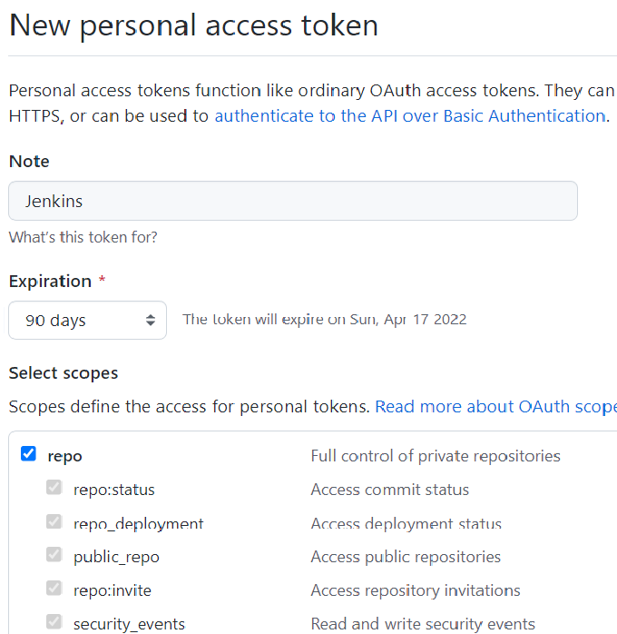
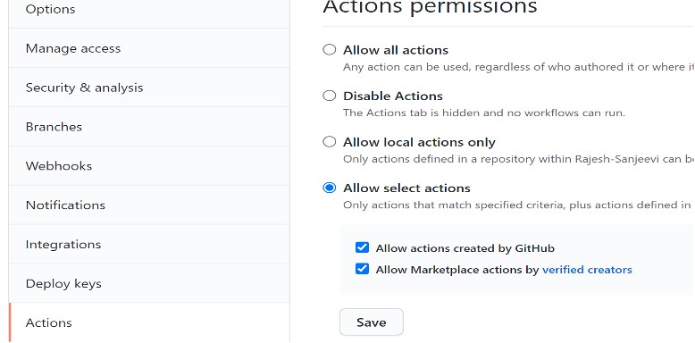

Prepare GitHub repositories
===========================

.. include:: icons.rst

|checkbox| **Setup forked repository**

*  If you don't have an alternate organization into which you can fork the repositories, then create that now
*  Fork the respective repository and its mentioned branches as per the below table
* Fetch the upstream for the respective branch and its relevant repository

Source code repositories (GitHub)
---------------------------------

There are three public repositories that are used in the overall node setup.

+----+---------------------+-----------------------------------------------+--------------------------------------------------------+
| No | **Repository**      | **Description**                               | **URL and branch**                                     |
+====+=====================+===============================================+========================================================+
| 1  | openidl-aais-gitops | This is the key repository that is used in    | https://github.com/openidl-org/openidl-aais-gitops.git |
|    |                     | setting up the node.                          | branch: develop-nginx-v1                               |
+----+---------------------+-----------------------------------------------+--------------------------------------------------------+
| 2  | openidl-main        | application codes are managed in this         | https://github.com/openidl-org/openidl-main.git        |
|    |                     | repository. Indirectly used in the pipelines  | branch: develop                                        |
+----+---------------------+-----------------------------------------------+--------------------------------------------------------+
| 3  | openidl-etl         | There are lambda functions used and those     | https://github.com/openidl-org/openidl-etl.git         |
|    |                     | code is located in this repository. Indirectly| branch: develop                                        |
|    |                     | used.                                         |                                                        |
+----+---------------------+-----------------------------------------------+--------------------------------------------------------+

|NOTE| **Node down the repository URLs and the branches**

|checkbox| **Setup github user and personal access tokens**

A user account with necessary permissions to manage these repositories
is required. Further provision a Personal Access Token with Selected
scopes as **“repo”**.

The following are the areas the token is used. A single PAT or multiple
PAT can be provisioned and used according to each organization
decisions. Either provision one or below listed number of tokens and use
accordingly.

+----+---------------+------------------------------------------------+
| No | **PAT**       | **Description**                                |
+====+===============+================================================+
| 1  | PAT 1         | A personal access token which will be used by  |
|    |               | Jenkins to connect to GitHub. This token will  |
|    |               | be added as a username/password secret in      |
|    |               | Jenkins to allow it to connect to repositories |
|    |               | successfully.                                  |
+----+---------------+------------------------------------------------+
| 2  | PAT 2         | A personal access token which will be used by  |
|    |               | AWX/Tower to connect to source control to sync |
|    |               | project (playbooks). This will be added as a   |
|    |               | source control credential in AWX/Tower and     |
|    |               | further used to sync playbooks.                |
+----+---------------+------------------------------------------------+
| 3  | PAT 3         | A personal access token used by ansible        |
|    |               | playbooks to download content from the         |
|    |               | repository during playbook run on remote host. |
+----+---------------+------------------------------------------------+

1. To provision PAT in GitHub (Source control) login to GitHub, go to
   settings => Developer settings => Personal access tokens => Generate
   new token.

2. Name the token, set expiration as either no expiration or required
   number of days if decided to refresh on a specific interval.

3. Set the selected scopes as “repo”

|note| **Note down the personal access tokens created and the github user account in which it is created for further use**

Best practices to consider in setting up GitHub repository
----------------------------------------------------------

|checkbox| **Follow best practices in github**

The below are best practices recommended in setting up a GitHub repository and for more details refer to GitHub documentation. However, these are only optional for enabling the pipeline.

#. Enable appropriate branch protection rules to manage who can push/pull to a branch
#. Enable required status checks, either strict or loose to have controlled updates to the branch
#. Configure how to merge based on requirements (Option A: Allow merge commits, Option B: Allow squash merging, Option C: Allow rebase merging)
#. Disable auto merge
#. Disable auto delete of head branch
#. Enable who can have access to repository
#. Enable branch protection by setting up

	#. require pull requests review before merging,
	#. require conversion resolution before merging

#. Protect who can push to branch directly
#. Setup notifications related to branch updates/changes
#. Setup artifact and log retention as per needs
#. Configure necessary secrets according to requirements at Organization, Environment or Repository level.
#. Setup Runner configuration - Allow select actions especially those created by GitHub and verified marketplace actions as below.

|NOTE| ** The last step in enabling github actions is optional as and when Github actions pipeline are used, otherwise not applicable**

