===========================================
Infrastructure as Code using Jenkins
===========================================

This document describes how to build openIDL nodes using Jenkins pipelines
which works with Terraform Cloud/Enterprise and AWX. 

Environment Required
====================

1. Source code repository (GitHub)

2. Jenkins

3. Terraform Cloud/Enterprise

4. Ansible Tower /AWX (open source)

.. include:: iac-prepare-aws-environment.rst

.. include:: iac-setup-user-with-inline-policy.rst

.. include:: iac-update-role-with-trust-policy.rst

.. include:: iac-setup-github-repo.rst

Source code repository (GitHub)
-------------------------------

The following are the two repositories involved.

+----+---------------------+-----------------------------------------------+
| No | **Repository**      | **Description**                               |
+====+=====================+===============================================+
| 1  | openidl-aais-gitops | Infrastructure as a code repository. This     |
|    |                     | repository is used to provision               |
|    |                     | Infrastructure using related pipelines.       |
+----+---------------------+-----------------------------------------------+
| 2  | openidl-main        | Application specific code repository. This    |
|    |                     | repository holds application code and is used |
|    |                     | to build and deploy the images.               |
+----+---------------------+-----------------------------------------------+

|checkbox| **Setup github user and personal access tokens**

A user account with necessary permissions to manage these repositories
is required. Further provision a Personal Access Token with Selected
scopes as **“repo”**.

The following are the areas the token is used. A single PAT or multiple
PAT can be provisioned and used according to each organization
decisions. Either provision one or below listed number of tokens and use
accordingly.

+----+---------------+------------------------------------------------+
| No | **PAT**       | **Description**                                |
+====+===============+================================================+
| 1  | PAT 1         | A personal access token which will be used by  |
|    |               | Jenkins to connect to GitHub. This token will  |
|    |               | be added as a username/password secret in      |
|    |               | Jenkins to allow it to connect to repositories |
|    |               | successfully.                                  |
+----+---------------+------------------------------------------------+
| 2  | PAT 2         | A personal access token which will be used by  |
|    |               | AWX/Tower to connect to source control to sync |
|    |               | project (playbooks). This will be added as a   |
|    |               | source control credential in AWX/Tower and     |
|    |               | further used to sync playbooks.                |
+----+---------------+------------------------------------------------+
| 3  | PAT 3         | A personal access token used by ansible        |
|    |               | playbooks to download content from the         |
|    |               | repository during playbook run on remote host. |
+----+---------------+------------------------------------------------+

1. To provision PAT in GitHub (Source control) login to GitHub, go to
   settings => Developer settings => Personal access tokens => Generate
   new token.

2. Name the token, set expiration as either no expiration or required
   number of days if decided to refresh on a specific interval.

3. Set the selected scopes as “repo”

.. image:: images3/image1.png

|note| **NOTE:** Once the necessary tokens are provisioned, please get them
recorded to enable them as secrets/credentials in Jenkins/AWX in next
steps.

.. include:: iac-github-bestpractices.rest

Terraform Cloud/Enterprise
==========================

Terraform Cloud or Terraform Enterprise are assumed to be setup.  Please see your administrator for how to accomplish this.

The following are items are required to setup in Terraform.

1. User Token/Team Token

2. Workspaces

3. Variable Set

Terraform User/Team Token
-------------------------

|checkbox| **Setup terraform token**

A user token/team token is required to allow Jenkins to authenticate and
successfully communicate with Terraform. It depends on an organization
to choose between the type of token used according to their need.

TFC/TFE User Token
~~~~~~~~~~~~~~~~~~

1. Login to Terraform Cloud/Enterprise go to User settings

2. Create an API token

|image1| |image2|

TFC/TFE Team Token 
~~~~~~~~~~~~~~~~~~

1. Login to Terraform Cloud/Enterprise, go to Organization settings

2. Go to Teams to setup up a new team and provision a team token or go
   to existing team and provision a team API token.

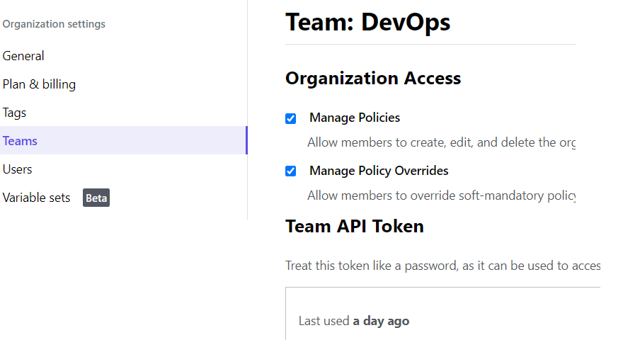

Workspaces
----------

The terraform code to provision necessary Infrastructure resources for
OpenIDL node is provisioned into two independent sets. The first set is
used to provision AWS resources and the other one to provision K8s
resources. There is a dependency in provisioning K8s which are addressed
in the first set of code and before provisioning K8s.

For example, K8s resources like config-map, storage class and ha proxy
have dependencies with the EKS cluster which gets provisioned before these
resources. Hence two sets of code are managed which requires two
different terraform workspaces in the environment to manage and
configure. The details are below.

Workspace to manage K8S Resources
~~~~~~~~~~~~~~~~~~~~~~~~~~~~~~~~~

|checkbox| **Create K8S Workspace**

1. A workspace to manage K8s resources is required. Create a new
   workspace and choose workflow as “API-Driven workflow” and give a
   meaningful name.  Like <org name>-k8s-workspace

2. Open the workspace go to settings => General and set the execution
   mode to Remote, Apply method as Manual and Terraform version above
   1.1.2

**Note**\ *: This workspace refers to the state file of AWS resources
workspace.*

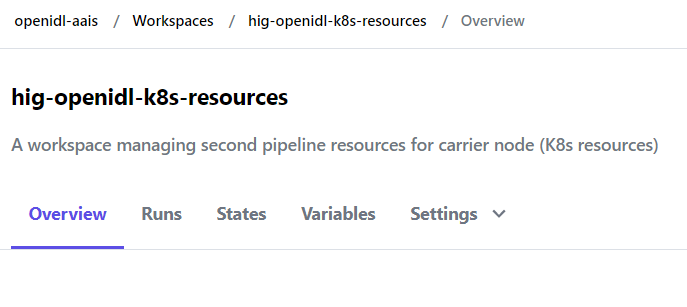

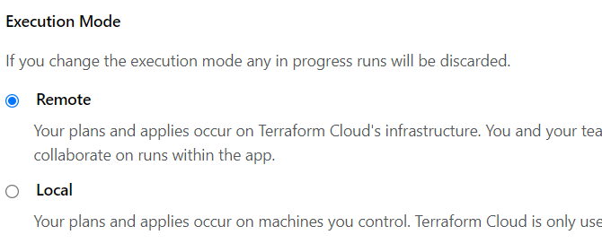

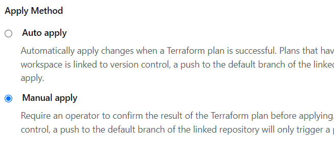

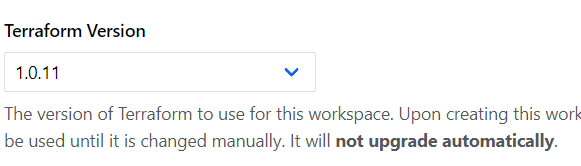

Workspace to manage AWS Resources
~~~~~~~~~~~~~~~~~~~~~~~~~~~~~~~~~

|checkbox| **Create AWS Workspace**

1. A workspace to manage AWS resources is required. Create a new
   workspace and choose workflow as “API-Driven workflow” and give a
   meaningful name. Like <org name>-aws-workspace

2. Open the workspace go to settings => General and set the execution
   mode to Remote, Apply method as Manual and Terraform version above
   1.1.2

3. And finally, *allow the state file of this workspace is accessible to
   the workspace used to manage K8s resources.*

**Note:**\ *This workspace shares its state file with K8s resources
workspace*

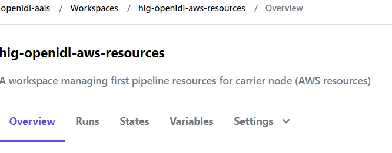

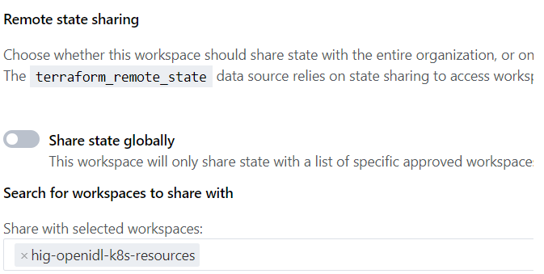

Variable Set
------------

|checkbox| **Enter terraform variables**

All the terraform variables and their values (including sensitive and
non-sensitive) are added in a variable set. The details of actual
variables and samples can be referred in the repository under directory
“aws/templates”.

All the variables in the templates are required to add in the variable
set. The detailed description of the variable’s significance is
documented above.

The variable set is preferred as it can be shared across workspaces
which is the typical use case in our solution. Configure variable set
and share them across the workspace’s setup in previous section.

**NOTE:** When you are entering variables, in case of complex data types
like maps, lists etc, follow HCL format and ensure the checkbox HCL is
checked. Please refer to the below link and section “variable values and
format”

https://www.terraform.io/cloud-docs/workspaces/variables/managing-variables

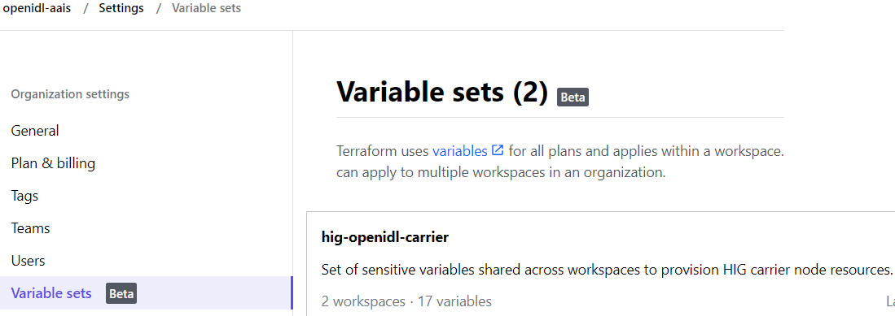

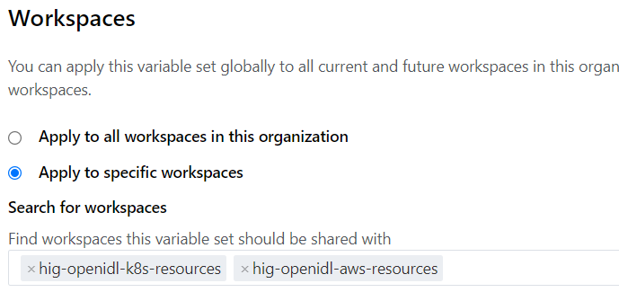

Below is a list of variables, what they are for and some help with template values.

.. csv-table:: terraform variables
   :file: table-terraform-variables.csv
   :header-rows: 1

Team Access
-----------

Finally in each workspace configured enable team access in case team
token is chosen as preferred method for API access.

.. image:: images3/image15.png
   :width: 5.00833in
   :height: 3.16667in

Jenkin’s Environment
====================

1. Plugins

2. Node labels

3. Global tools configuration

4. Configure System – Ansible Tower/AWX

5. Credentials

Plugins required
----------------

..

   The following are the additional plugins required to enable other
   than standard plugins which are installed during initial Jenkins’s
   setup.

1. HTTP Request Plugin

2. Source Code Plugin (Git Plugin)

3. Ansible Tower Plugin

5. AnsiColor

..

   .. image:: images3/image16.png

Node labels 
-----------

The Jenkins pipeline job code uses a node label “openidl”. Do either of
the below.

1. Setup “openidl” as node label to an existing node (we are using just
   master, and we updated the label in the master configuratioin)

2. Setup a new node and label it to “openidl”

3. Update Jenkins pipeline code to fit to a label that refers to a node
   in your environment.

The steps to labeling a node is skipped as it can be handled by
Jenkins’s administrator.

In case chosen to update the pipeline code with relevant node label.
Refer to the pipeline code to the following section and replace
“openidl” with custom label.

Go to the relevant repository and to the folder Jenkins-jobs/. For each
job code, update as required.

+-----------------------------+----------------------------------------+
| node {                      | node(‘openidl’)                        |
|                             |                                        |
| label “openidl”             |                                        |
|                             |                                        |
| }                           |                                        |
+=============================+========================================+
+-----------------------------+----------------------------------------+

Global tools configuration
--------------------------

1. Go to Jenkins => Mange Jenkins => Global Tool Configuration

2. Ensure Git and Terraform are configured according to your environment

3. Note the command shown here works for Ubuntu node and for Linux it
   will be different. Hence configure Git according to your nodes
   operating system.

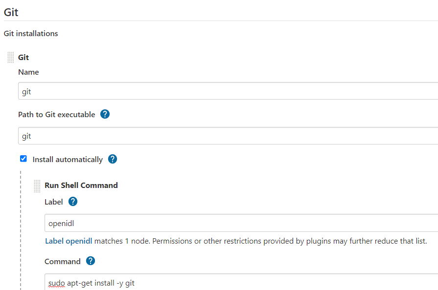

tool home should be ‘/usr/bin/git’

4. 

Configure System (AWX/Ansible Tower)
------------------------------------

1. Go to Jenkins => Manage Jenkins => Configure System

2. Go to Ansible Tower

3. Click on Add, Give a name to the instance “AWX”. Please note “AWX”
   instance name is used in Jenkins’s pipeline code. In case a different
   name is used, the pipeline code needs to be updated.

4. Update the actual URL of Ansible Tower/AWX instance to make API calls

5. Include the username/password to authenticate Jenkins in AWX/Tower.
   Hence get the user first created in AWX/Tower and get that credential
   added in Jenkins as username/password credential type before setting
   this up. Refer to the section <??> on how to setup a Jenkins
   username/password credential.

6. During development instance SSL is not used, however in production
   environment SSL should be enabled which is not documented here, refer
   to relevant Jenkins’s documentation on enabling SSL.

7. Test the connection between Jenkins and Ansible is successful to
   proceed further.

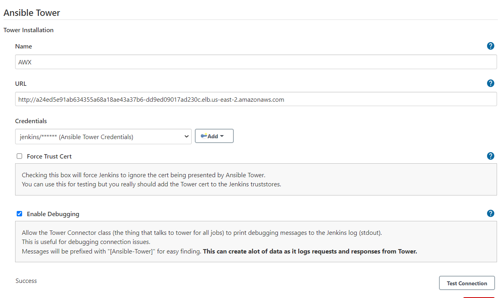

Credentials 
-----------

The following are the credential types used. The steps to create and
configure detailed further in the document.

+----+------------+-----------------+---------------------------------+
| No | Purpose    | **Cred Type**   | **Description**                 |
+====+============+=================+=================================+
| 1  | Jenkins    | Username and    | An AWX user account having      |
|    | access to  | Password        | permissions to run jobs, access |
|    | AWX        |                 | required credentials, project,  |
|    |            |                 | and resources. A username and   |
|    |            |                 | password are used.              |
+----+------------+-----------------+---------------------------------+
| 2  | Jenkins    | Username and    | GitHub username and Personal    |
|    | access to  | Password (PAT)  | Access Token. This is used by   |
|    | GitHub     |                 | Jenkins to work with source     |
|    | (source    |                 | control                         |
|    | control)   |                 |                                 |
+----+------------+-----------------+---------------------------------+
| 3  | Jenkins    | Secret Text     | A User/team token created in    |
|    | access to  |                 | Terraform Cloud/Enterprise. Get |
|    | Terraform  |                 | that added as secret text in    |
|    | Cloud/     |                 | Jenkins.                        |
|    | Enterprise |                 |                                 |
+----+------------+-----------------+---------------------------------+

Username and Password Type 
~~~~~~~~~~~~~~~~~~~~~~~~~~

1. Login to Jenkins go to Manage Jenkins => Manage Credentials => Stores
   scoped to Jenkins (Jenkins) => Global Credentials (unrestricted) =>
   Add credentials

2. Then choose Kind as “Username Password” and key in username,
   Password, Description and a unique ID which would be referred in the
   pipeline code. (An example below)

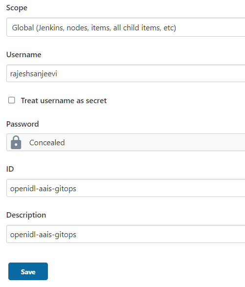

Secret Text Type
~~~~~~~~~~~~~~~~

1. Login to Jenkins go to Manage Jenkins => Manage Credentials => Stores
   scoped to Jenkins (Jenkins) => Global Credentials (unrestricted) =>
   Add credentials

2. Choose Kind as secret text, enter secret text like Token in “secret”
   field and name the secret ID as unique since it will be used in
   pipeline code. (An example below)

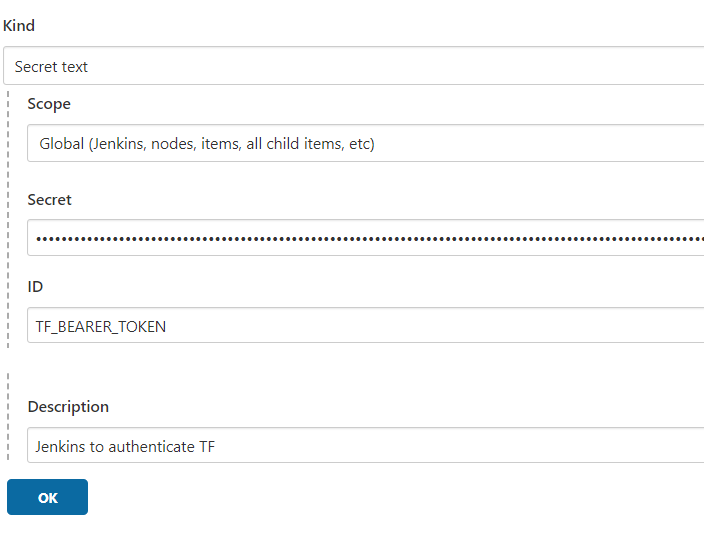

Terraform code changes to adapt to Terraform Cloud/Enterprise 
=============================================================

The following the major changes made to the Terraform code to adapt to
Terraform Cloud/Enterprise.

Ensure that the code is updated before it is used.

1. Activate the right AWS provider configuration in the code for
   aws_resources code set. |image5|

2. Comment the terraform backend section of the code in both
   aws_resources and k8s_resources code set in the file main.tf. Below
   is an example.

..

   .. image:: images3/image25.png
      :width: 5.7in
      :height: 2.125in

3. Activate the AWS provider configuration as below for k8s_resources
   code set and for remaining providers like Kubernetes and helm
   requires no changes.

..

   .. image:: images3/image26.png
      :width: 3.60833in
      :height: 3.34167in

4. Finally update/activate the code relevant code snippet as below for
   data.tf in k8s_resources code set.

..

   .. image:: images3/image27.png
      :width: 3.275in
      :height: 4.075in

Ansible Tower/AWX Environment 
=============================

The following objects/items are required to setup for the pipelines to
work.

1. A User Account

2. Credential Types

3. Inventory, Group and Host

4. Credentials

5. Projects

6. Templates

User Account 
----------------

A user account to allow Jenkins to successfully work with Ansible
Tower/AWX API. The user should have necessary permissions to run jobs
and its relevant objects. In development used system administrator type,
however in production use role-based access control using teams/roles.

.. image:: images3/image28.png

Credential Types
----------------

For the OpenIDL deployment there are infrastructure and application
related pipelines. They require specific credentials and additional
variables. Hence custom credential types are used to simply the setup.
The following are the credential types and steps to configure them.

1. OpenIDL-IAC => Used in infrastructure provisioning jobs

2. OpenIDL-APP => Used in application deployment jobs

3. OpenIDL-IAC-AWSUser-BAF => AWS IAM user credentials used with
   Blockchain automation jobs

OpenIDL-IAC
~~~~~~~~~~~

1. Login into Ansible Tower/AWX instance, Go to Administration

2. Go to Credential Types

3. Click on Add

4. Name it as OpenIDL-IAC and paste the below configuration in each
relevant section.

**Input Configuration**

+-----------------------------------------------------------------------+
| fields:                                                               |
|                                                                       |
| - id: aws_access_key                                                  |
|                                                                       |
| type: string                                                          |
|                                                                       |
| label: AWS access key                                                 |
|                                                                       |
| secret: true                                                          |
|                                                                       |
| help_text: AWS IAM user access key                                    |
|                                                                       |
| - id: aws_secret_key                                                  |
|                                                                       |
| type: string                                                          |
|                                                                       |
| label: AWS secret key                                                 |
|                                                                       |
| secret: true                                                          |
|                                                                       |
| help_text: AWS IAM user secret key                                    |
|                                                                       |
| - id: aws_iam_role                                                    |
|                                                                       |
| type: string                                                          |
|                                                                       |
| label: AWS IAM role                                                   |
|                                                                       |
| help_text: AWS IAM role to be assumed                                 |
|                                                                       |
| - id: aws_external_id                                                 |
|                                                                       |
| type: string                                                          |
|                                                                       |
| label: AWS external id                                                |
|                                                                       |
| help_text: Externl ID set during IAM user/role configuration          |
|                                                                       |
| - id: aws_region                                                      |
|                                                                       |
| type: string                                                          |
|                                                                       |
| label: AWS region                                                     |
|                                                                       |
| help_text: AWS Region                                                 |
|                                                                       |
| - id: aws_account_number                                              |
|                                                                       |
| type: string                                                          |
|                                                                       |
| label: AWS account number                                             |
|                                                                       |
| secret: true                                                          |
|                                                                       |
| help_text: AWS account number                                         |
|                                                                       |
| - id: baf_image_repo                                                  |
|                                                                       |
| type: string                                                          |
|                                                                       |
| label: BAF image repository                                           |
|                                                                       |
| help_text: Blockchain automation framework Docker image repository    |
|                                                                       |
| - id: blk_cluster_name                                                |
|                                                                       |
| type: string                                                          |
|                                                                       |
| label: Blockchain cluster name                                        |
|                                                                       |
| help_text: Blockchain EKS cluster name                                |
|                                                                       |
| - id: app_cluster_name                                                |
|                                                                       |
| type: string                                                          |
|                                                                       |
| label: Application cluster name                                       |
|                                                                       |
| help_text: OpenIDL Application EKS cluster name                       |
|                                                                       |
| - id: gitops_repo_url                                                 |
|                                                                       |
| type: string                                                          |
|                                                                       |
| label: 'Gitops repository URL (without https://)'                     |
|                                                                       |
| help_text: Github repository URL                                      |
|                                                                       |
| - id: gitops_repo_branch                                              |
|                                                                       |
| type: string                                                          |
|                                                                       |
| label: Gitops repository branch                                       |
|                                                                       |
| help_text: Branch name in Github repository                           |
|                                                                       |
| - id: gitops_repo_user                                                |
|                                                                       |
| type: string                                                          |
|                                                                       |
| label: Gitops repository user                                         |
|                                                                       |
| help_text: GITHUB repository user                                     |
|                                                                       |
| - id: gitops_repo_user_token                                          |
|                                                                       |
| type: string                                                          |
|                                                                       |
| label: Gitops repository user PAT                                     |
|                                                                       |
| secret: true                                                          |
|                                                                       |
| help_text: GITHUB repository user token                               |
|                                                                       |
| - id: gitops_repo_user_email                                          |
|                                                                       |
| type: string                                                          |
|                                                                       |
| label: Gitops repository user email                                   |
|                                                                       |
| help_text: GITHUB repository user email id                            |
|                                                                       |
| required:                                                             |
|                                                                       |
| - aws_access_key                                                      |
|                                                                       |
| - aws_secret_key                                                      |
|                                                                       |
| - aws_iam_role                                                        |
|                                                                       |
| - aws_external_id                                                     |
|                                                                       |
| - aws_region                                                          |
|                                                                       |
| - aws_account_number                                                  |
|                                                                       |
| - blk_cluster_name                                                    |
|                                                                       |
| - baf_image_repo                                                      |
|                                                                       |
| - app_cluster_name                                                    |
|                                                                       |
| - gitops_repo_user                                                    |
|                                                                       |
| - gitops_repo_user_email                                              |
|                                                                       |
| - gitops_repo_user_token                                              |
+=======================================================================+
+-----------------------------------------------------------------------+

**Injector Configuration**

+-----------------------------------------------------------------------+
| extra_vars:                                                           |
|                                                                       |
| aws_region: '{{ aws_region }}'                                        |
|                                                                       |
| aws_iam_role: '{{ aws_iam_role }}'                                    |
|                                                                       |
| aws_access_key: '{{ aws_access_key }}'                                |
|                                                                       |
| aws_secret_key: '{{ aws_secret_key }}'                                |
|                                                                       |
| baf_image_repo: '{{ baf_image_repo }}'                                |
|                                                                       |
| aws_external_id: '{{ aws_external_id }}'                              |
|                                                                       |
| gitops_repo_url: '{{ gitops_repo_url }}'                              |
|                                                                       |
| app_cluster_name: '{{ app_cluster_name }}'                            |
|                                                                       |
| blk_cluster_name: '{{ blk_cluster_name }}'                            |
|                                                                       |
| gitops_repo_user: '{{ gitops_repo_user }}'                            |
|                                                                       |
| aws_account_number: '{{ aws_account_number }}'                        |
|                                                                       |
| gitops_repo_branch: '{{ gitops_repo_branch }}'                        |
|                                                                       |
| gitops_repo_user_email: '{{ gitops_repo_user_email }}'                |
|                                                                       |
| gitops_repo_user_token: '{{ gitops_repo_user_token }}'                |
+=======================================================================+
+-----------------------------------------------------------------------+

4. Save and close, screenshot below.

..

   .. image:: images3/image29.png

OpenIDL-IAC-AWSUser-BAF
~~~~~~~~~~~~~~~~~~~~~~~

Similarly repeat the above steps to setup this credential type as well.

**Input Configuration**

+-----------------------------------------------------------------------+
| fields:                                                               |
|                                                                       |
| - id: baf_user_access_key                                             |
|                                                                       |
| type: string                                                          |
|                                                                       |
| label: baf_user_access_key                                            |
|                                                                       |
| help_text: AWS IAM user access key for baf                            |
|                                                                       |
| - id: baf_user_secret_key                                             |
|                                                                       |
| type: string                                                          |
|                                                                       |
| label: baf_user_secret_key                                            |
|                                                                       |
| secret: true                                                          |
|                                                                       |
| help_text: AWS IAM user secret key for baf                            |
|                                                                       |
| required:                                                             |
|                                                                       |
| - baf_user_access_key                                                 |
|                                                                       |
| - baf_user_secret_key                                                 |
+=======================================================================+
+-----------------------------------------------------------------------+

**Injector Configuration**

+-----------------------------------------------------------------------+
| extra_vars:                                                           |
|                                                                       |
| baf_user_access_key: '{{ baf_user_access_key }}'                      |
|                                                                       |
| baf_user_secret_key: '{{ baf_user_secret_key }}'                      |
+=======================================================================+
+-----------------------------------------------------------------------+

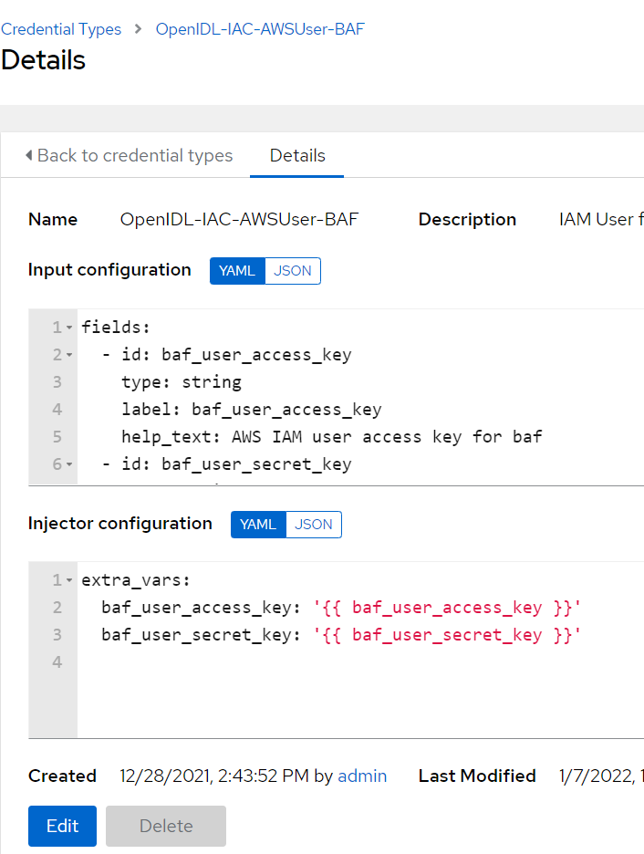

OpenIDL-APP
~~~~~~~~~~~

Similarly repeat the above steps to setup this credential type as well.

**Input Configuration**

+-----------------------------------------------------------------------+
| fields:                                                               |
|                                                                       |
| - id: aws_access_key                                                  |
|                                                                       |
| type: string                                                          |
|                                                                       |
| label: AWS access key                                                 |
|                                                                       |
| secret: true                                                          |
|                                                                       |
| help_text: AWS IAM user access key                                    |
|                                                                       |
| - id: aws_secret_key                                                  |
|                                                                       |
| type: string                                                          |
|                                                                       |
| label: AWS secret key                                                 |
|                                                                       |
| secret: true                                                          |
|                                                                       |
| help_text: AWS IAM user secret key                                    |
|                                                                       |
| - id: aws_iam_role                                                    |
|                                                                       |
| type: string                                                          |
|                                                                       |
| label: AWS IAM role                                                   |
|                                                                       |
| help_text: AWS IAM role to be assumed                                 |
|                                                                       |
| - id: aws_external_id                                                 |
|                                                                       |
| type: string                                                          |
|                                                                       |
| label: AWS external id                                                |
|                                                                       |
| help_text: Externl ID set during IAM user/role configuration          |
|                                                                       |
| - id: aws_region                                                      |
|                                                                       |
| type: string                                                          |
|                                                                       |
| label: AWS region                                                     |
|                                                                       |
| help_text: AWS Region                                                 |
|                                                                       |
| - id: gitrepo_name                                                    |
|                                                                       |
| type: string                                                          |
|                                                                       |
| label: 'Git Repository (without https://)'                            |
|                                                                       |
| help_text: Git repository URL                                         |
|                                                                       |
| - id: gitrepo_branch                                                  |
|                                                                       |
| type: string                                                          |
|                                                                       |
| label: Git branch name                                                |
|                                                                       |
| help_text: Git repository branch name                                 |
|                                                                       |
| - id: gitrepo_username                                                |
|                                                                       |
| type: string                                                          |
|                                                                       |
| label: Gitrepo username                                               |
|                                                                       |
| help_text: Git repository login username                              |
|                                                                       |
| - id: gitrepo_pat                                                     |
|                                                                       |
| type: string                                                          |
|                                                                       |
| label: Gitrepo PAT                                                    |
|                                                                       |
| secret: true                                                          |
|                                                                       |
| help_text: Git repository personl access token                        |
|                                                                       |
| - id: app_cluster_name                                                |
|                                                                       |
| type: string                                                          |
|                                                                       |
| label: Application cluster name                                       |
|                                                                       |
| help_text: OpenIDL Application EKS cluster name                       |
|                                                                       |
| - id: vault_secret_name                                               |
|                                                                       |
| type: string                                                          |
|                                                                       |
| label: vault secret name                                              |
|                                                                       |
| help_text: Vault secret name provisioned in AWS secrets manager       |
|                                                                       |
| required:                                                             |
|                                                                       |
| - aws_access_key                                                      |
|                                                                       |
| - aws_secret_key                                                      |
|                                                                       |
| - aws_iam_role                                                        |
|                                                                       |
| - aws_external_id                                                     |
|                                                                       |
| - aws_region                                                          |
|                                                                       |
| - gitrepo_username                                                    |
|                                                                       |
| - gitrepo_password                                                    |
|                                                                       |
| - gitrepo_name                                                        |
|                                                                       |
| - gitrepo_branch                                                      |
|                                                                       |
| - app_cluster_name                                                    |
|                                                                       |
| - vault_secret_name                                                   |
+=======================================================================+
+-----------------------------------------------------------------------+

**Injector Configuration**

+-----------------------------------------------------------------------+
| extra_vars:                                                           |
|                                                                       |
| aws_region: '{{ aws_region }}'                                        |
|                                                                       |
| aws_iam_role: '{{ aws_iam_role }}'                                    |
|                                                                       |
| gitrepo_name: '{{ gitrepo_name }}'                                    |
|                                                                       |
| aws_access_key: '{{ aws_access_key }}'                                |
|                                                                       |
| aws_secret_key: '{{ aws_secret_key }}'                                |
|                                                                       |
| gitrepo_branch: '{{ gitrepo_branch }}'                                |
|                                                                       |
| aws_external_id: '{{ aws_external_id }}'                              |
|                                                                       |
| app_cluster_name: '{{ app_cluster_name }}'                            |
|                                                                       |
| gitrepo_password: '{{ gitrepo_pat }}'                                 |
|                                                                       |
| gitrepo_username: '{{ gitrepo_username }}'                            |
|                                                                       |
| vault_secret_name: '{{ vault_secret_name }}'                          |
+=======================================================================+
+-----------------------------------------------------------------------+

..

   .. image:: images3/image31.png

Inventory, Group and Host 
-------------------------

   The OpenIDL ansible playbooks use the inventory group
   “ansible_provisioners” and a localhost. Hence setup the relevant
   inventory, its group and host details in Ansible Tower/AWX.

1. Login to the instance, go to Resources => Inventories => Add

2. Name it as “ansible_provisioners and save.

..

   .. image:: images3/image32.png

3. Now open the created inventory and go to Groups and click on Add

..

   .. image:: images3/image33.png

4. Name the group as “ansible_provisioners”.

..

   .. image:: images3/image34.png

5. Now go to inventory ansible_provisioners and then go to Hosts and
   click on Add to include localhost part of the group.

..

   .. image:: images3/image35.png

6. Note localhost is by default added to the inventory file part of
   playbook configuration in the repository. In case chosen to use
   alternate node then ensure that the relevant node is added to the
   ansible_provisioners group/inventory and further the same host
   information is added to the inventory file located in the path
   “awx-automation/inventory/ansible_provisioners” file in the github
   repositories as well. For example, below.

7. This entry should be added to both the repositories. (app and infra).

..

   .. image:: images3/image36.png

.. _credentials-1:

Credentials 
-----------

The following are the credentials to be configured in Ansible Tower/AWX.

1. Machine credential

2. Source Control credential

3. OpenIDL-IAC

4. OpenIDL-APP

5. OpenIDL-IAC-AWSUser-BAF

Machine Credential
~~~~~~~~~~~~~~~~~~

This credential is used by the playbook to authenticate a host to run
the playbooks. It may be either a localhost or remote node. This is a
system SSH credential configured to allow Ansible instance to access a
host to run the playbook.

First ensure the host (localhost/remotehost) is configured such access
and further the credential is added here.

1. Go to Ansible instance => Resource => Credentials and add.

2. Ensure the credential type chosen is Machine

3. Enter a name, Input username of the account and add private key of
   the SSH key pair which is configured in the system and also enable
   privilege escalation method as sudo.

4. Note that in development an account “ansible” is used with sudo
   permissions. The account can be adjusted with permissions carefully
   reviewing the playbook actions and relevant permissions only to allow
   sudo commands.

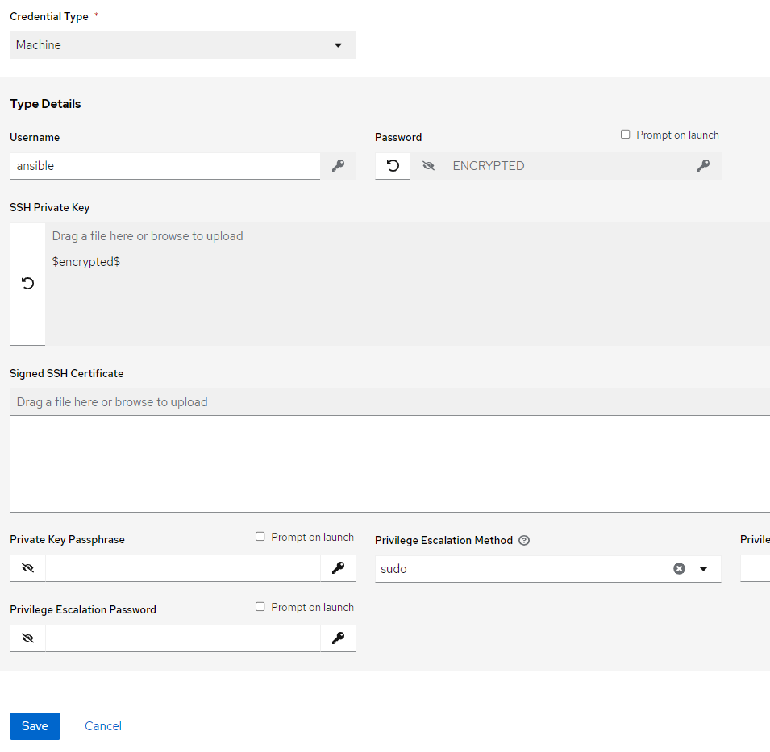

Source Control Credential 
~~~~~~~~~~~~~~~~~~~~~~~~~

Similarly create a credential of type source control to enter GitHub
user credential (username and PAT) to allow Ansible to successfully work
with repositories. The screenshot for reference.

1. Name the credential

2. Select Type as Source Control

3. Enter the GitHub username and Personal Access Token (alternate is to
   use SSH method)

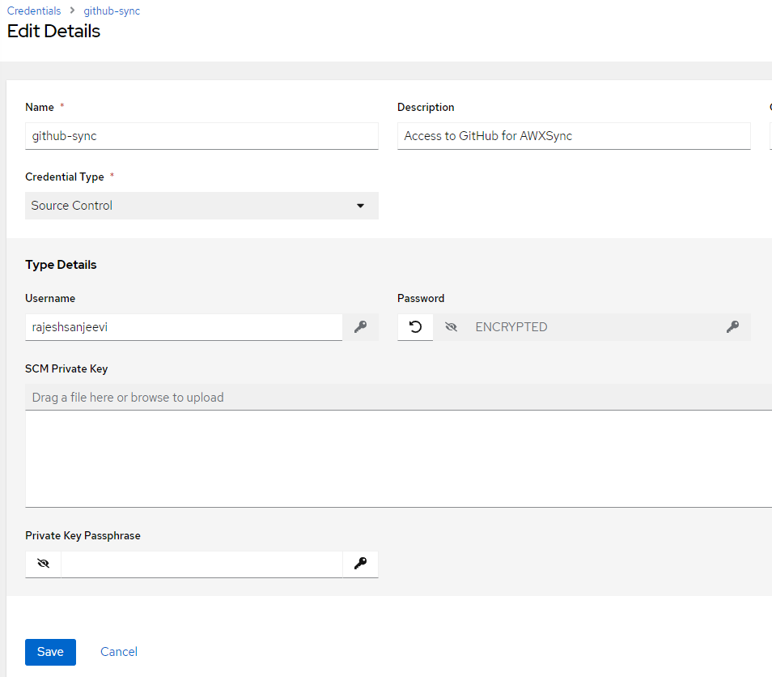

.. _openidl-iac-1:

OpenIDL-IAC
~~~~~~~~~~~

The next step is to use credential of type OpenIDL-IAC. This will be
used by infrastructure jobs. A reference screenshot and significance of
each field is detailed in below table.

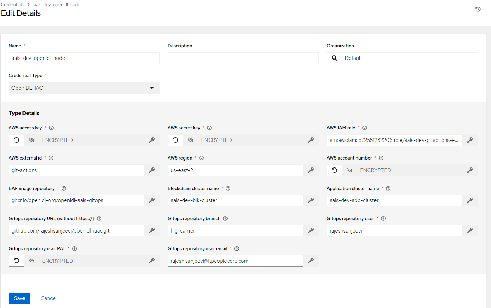

+-----+--------------+-------------------------------------------------+
| **S | **Key**      | **Description**                                 |
| N   |              |                                                 |
| o** |              |                                                 |
+=====+==============+=================================================+
| 1   | Credential   | Select type OpenIDL-IAC                         |
|     | Type         |                                                 |
+-----+--------------+-------------------------------------------------+
| 2   | AWS access   | AWS access key of GitHub actions IAM user       |
|     | key          | provisioned                                     |
+-----+--------------+-------------------------------------------------+
| 3   | AWS secret   | AWS secret key of GitHub actions IAM user       |
|     | key          | provisioned                                     |
+-----+--------------+-------------------------------------------------+
| 4   | AWS IAM role | AWS IAM role provisioned to be assumed by       |
|     |              | GitHub actions IAM user                         |
+-----+--------------+-------------------------------------------------+
| 5   | AWS external | “git-actions” by default                        |
|     | id           |                                                 |
+-----+--------------+-------------------------------------------------+
| 6   | AWS region   | AWS region in which resources are provisioned   |
+-----+--------------+-------------------------------------------------+
| 7   | AWS account  | AWS account number                              |
|     | number       |                                                 |
+-----+--------------+-------------------------------------------------+
| 8   | BAF image    | The repository in which Docker image for        |
|     | repository   | Blockchain Automation Framework is located.     |
|     |              | Presently this is public repository.            |
+-----+--------------+-------------------------------------------------+
| 9   | Blockchain   | Name of the cluster provisioned for blockchain  |
|     | cluster name | resources                                       |
+-----+--------------+-------------------------------------------------+
| 10  | Application  | Name of the cluster provisioned for application |
|     | cluster name | resources                                       |
+-----+--------------+-------------------------------------------------+
| 11  | Gitops       | GitHub repository URL in which infrastructure   |
|     | repository   | code is located                                 |
|     | URL          |                                                 |
+-----+--------------+-------------------------------------------------+
| 12  | Gitops       | GitHub repository branch to be used             |
|     | repository   |                                                 |
|     | branch       |                                                 |
+-----+--------------+-------------------------------------------------+
| 13  | GitOps       | Username has access to the repository           |
|     | repository   |                                                 |
|     | user         |                                                 |
+-----+--------------+-------------------------------------------------+
| 14  | Gitops       | Personal access token of the user to            |
|     | repository   | authenticate with GitHub to use with ansible    |
|     | user PAT     | playbooks                                       |
+-----+--------------+-------------------------------------------------+
| 15  | Gitops       | User email ID of the GitHub repository user     |
|     | repository   | used                                            |
|     | user email   |                                                 |
+-----+--------------+-------------------------------------------------+

.. _openidl-app-1:

OpenIDL-APP
~~~~~~~~~~~

Create the credential of type OpenIDL-APP as described below which will
be used by jobs related to OpenIDL application.

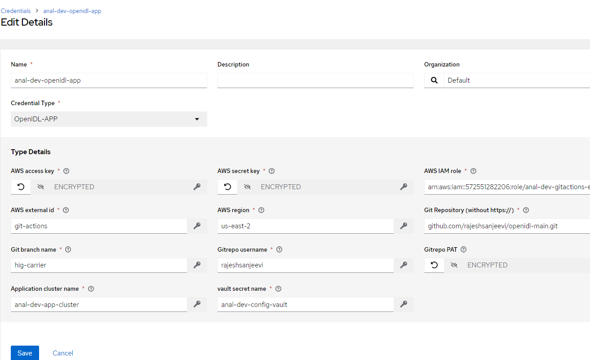

+-----+---------------------+-----------------------------------------+
| **S | **Key**             | **Description**                         |
| N   |                     |                                         |
| o** |                     |                                         |
+=====+=====================+=========================================+
| 1   | Credential Type     | OpenIDL-APP                             |
+-----+---------------------+-----------------------------------------+
| 2   | AWS access key      | AWS access key of GitHub actions IAM    |
|     |                     | user provisioned                        |
+-----+---------------------+-----------------------------------------+
| 3   | AWS secret key      | AWS secret key of GitHub actions IAM    |
|     |                     | user provisioned                        |
+-----+---------------------+-----------------------------------------+
| 4   | AWS IAM role        | AWS IAM role provisioned to be assumed  |
|     |                     | by GitHub actions IAM user              |
+-----+---------------------+-----------------------------------------+
| 5   | AWS external id     | “git-actions” by default                |
+-----+---------------------+-----------------------------------------+
| 6   | AWS region          | AWS region in which resources are       |
|     |                     | provisioned                             |
+-----+---------------------+-----------------------------------------+
| 7   | Git Repository      | GitHub repository related to            |
|     |                     | applications                            |
+-----+---------------------+-----------------------------------------+
| 8   | Git branch name     | Name of the GitHub branch               |
+-----+---------------------+-----------------------------------------+
| 9   | Gitrepo username    | Email id of the GitHub user used        |
+-----+---------------------+-----------------------------------------+
| 10  | Gitrepo PAT         | Personal access token created           |
|     |                     | previously to use with ansible          |
|     |                     | playbooks                               |
+-----+---------------------+-----------------------------------------+
| 11  | Application cluster | Application cluster name                |
|     | name                |                                         |
+-----+---------------------+-----------------------------------------+
| 12  | Vault Secret name   | Secret created in AWS secret manage     |
|     |                     | which holds credentials of vault. The   |
|     |                     | standard format is                      |
|     |                     | <orgname>-<env>-config-vault            |
+-----+---------------------+-----------------------------------------+

.. _openidl-iac-awsuser-baf-1:

OpenIDL-IAC-AWSUser-BAF
~~~~~~~~~~~~~~~~~~~~~~~

Finally, provision credential of type OpenIDL-IAC-AWSUser-BAF. Choose
the relevant credential type, key in AWS access key and secret key of
AWS IAM user provisioned related to BAF.

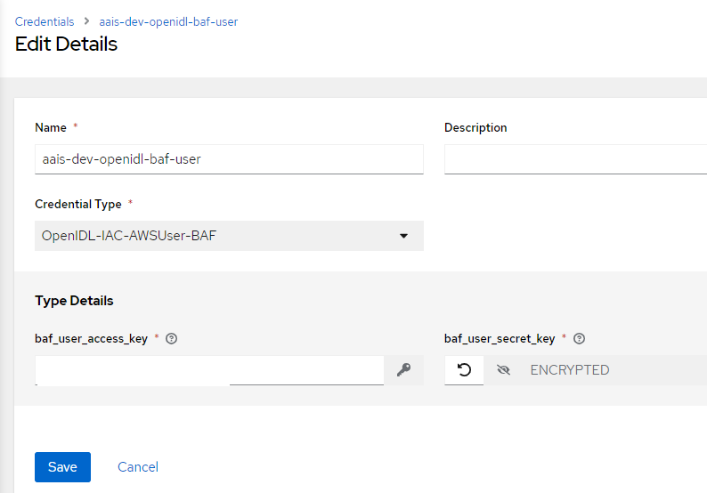

Projects 
--------

The next step is to configure projects which is used to pull the ansible
playbook contents from GitHub to ansible tower/AWX.

1. openidl-main

2. openidl-aais-gitops

openidl-main
~~~~~~~~~~~~

1. Go to Ansible => Resources => Projects => Add and get the details
   added referring to the screenshot below.

2. Ensure the relevant organization, Execution environment are chosen

3. Select source control credential type as Git for GitHub.

4. Key in the Source Control URL, Branch and relevant code check in
   options

5. Finally choose the source control credential created previously to
   allow Ansible Tower/AWX to authenticate for syncing the code from
   repository to Ansible.

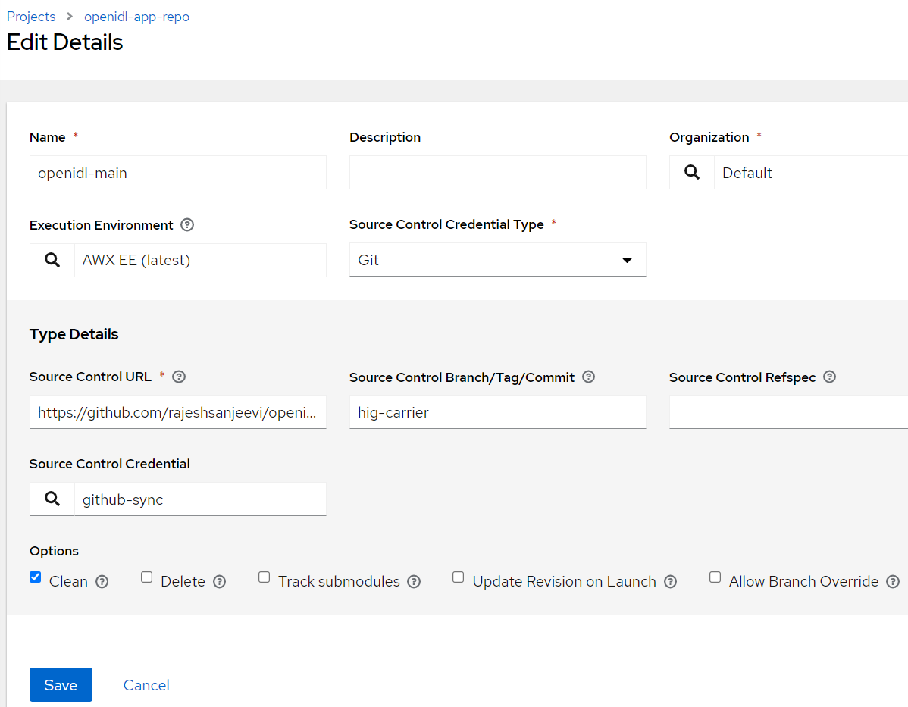

openidl-aais-gitops
~~~~~~~~~~~~~~~~~~~

Repeat the same above steps to configure project for infrastructure
code.

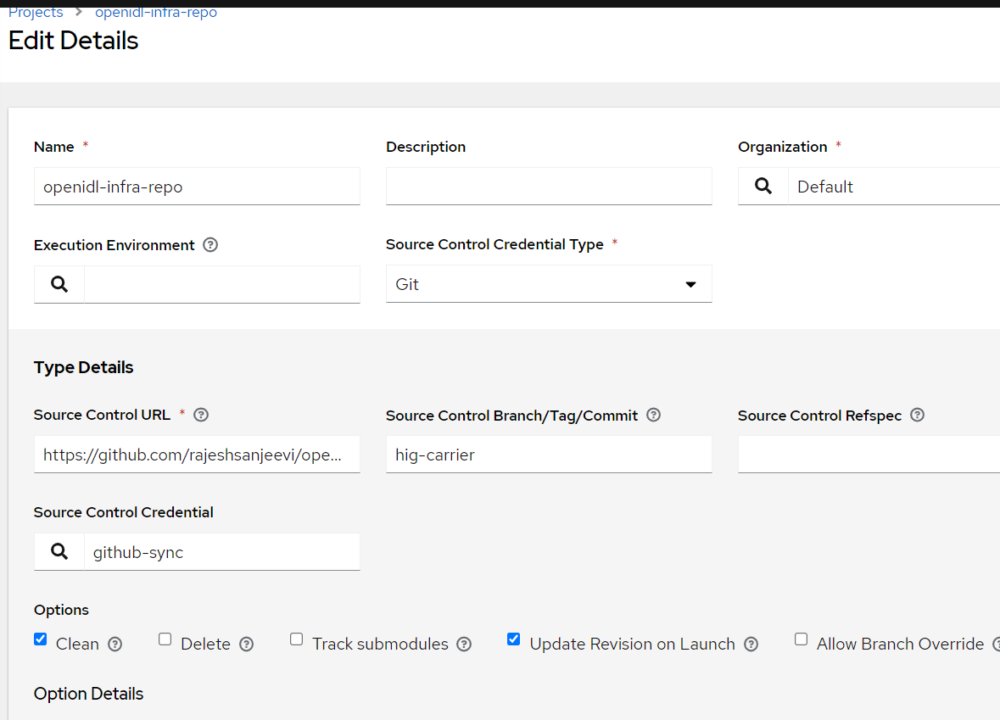

Templates 
---------

It is time to configure ansible job templates in Ansible Tower/AWX. The
following are the list of job templates required to configure.

1. Vault install

2. MongoDB install

3. Blockchain

4. Register Users (BAF preregister users)

5. OpenIDL application secrets install

6. OpenIDL application install

Vault Install
~~~~~~~~~~~~~

1. Login to Ansible Tower/AWX, Go to Resources => Templates => Add

2. Key in Job name. The format is <org_name>-<env>-openidl-vault.

..

   **Org_name:** First 4 characters of org_name. Note Jenkins pipeline
   code refers to the job template name and hence it is vital.

   **Env:** dev \| test \| prod

3.  Select Job type as Run and check on Prompt on Launch

4.  Choose inventory as ansible_provisioners which was configured in
    previous step.

5.  Choose the project that holds the IaC code. (openidl-aais-gitops)
    configured in previous step

6.  Choose the relevant execution environment

7.  Choose the playbook “awx-automation/vault.yml”.

8.  Choose the following credentials.

    a. Machine credential configured in previous step

    b. OpenIDL-IAC credential configured in previous step

9.  Choose prompt on Launch for variables (mandatory)

10. Set relevant verbosity level, Timeout at minimum 1800 seconds.

11. Set the Option “Privilege Escalation”.

..

   |image6|\ |image7|

MongoDB Install 
~~~~~~~~~~~~~~~

1. Login to Ansible Tower/AWX, Go to Resources => Templates => Add

2. Key in Job name. The format is <org_name>-<env>-openidl-mongodb.

..

   **Org_name:** First 4 characters of org_name. Note Jenkins pipeline
   code refers to the job template name and hence it is vital.

   **Env:** dev \| test \| prod

3.  Select Job type as Run and check on Prompt on Launch

4.  Choose inventory as ansible_provisioners which was configured in
    previous step.

5.  Choose the project that holds the IaC code. (openidl-aais-gitops)
    configured in previous step

6.  Choose the relevant execution environment

7.  Choose the playbook “awx-automation/mongodb.yml”.

8.  Choose the following credentials.

    a. Machine credential configured in previous step

    b. OpenIDL-IAC credential configured in previous step

9.  Choose prompt on Launch for variables (mandatory)

10. Set relevant verbosity level, Timeout at minimum 1800 seconds.

11. Set the Option “Privilege Escalation”.

.. image:: images3/image46.png

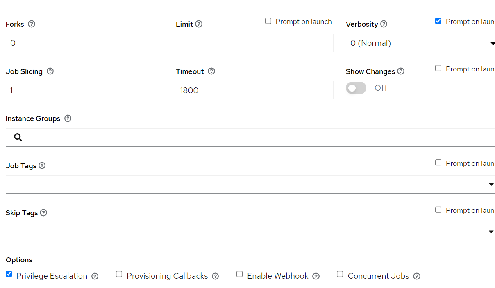

BlockChain 
~~~~~~~~~~

1. Login to Ansible Tower/AWX, Go to Resources => Templates => Add

2. Key in Job name. The format is <org_name>-<env>-openidl-baf.

..

   **Org_name:** First 4 characters of org_name. Note Jenkins pipeline
   code refers to the job template name and hence it is vital.

   **Env:** dev \| test \| prod

3.  Select Job type as Run and check on Prompt on Launch

4.  Choose inventory as ansible_provisioners which was configured in
    previous step.

5.  Choose the project that holds the IaC code. (openidl-aais-gitops)
    configured in previous step

6.  Choose the relevant execution environment

7.  Choose the playbook “awx-automation/fabric-network.yml”.

8.  Choose the following credentials.

    a. Machine credential configured in previous step

    b. OpenIDL-IAC credential configured in previous step

    c. OpenIDL-IAC-AWSUser-BAF configured in previous step

9.  Choose prompt on Launch for variables (mandatory)

10. Set relevant verbosity level, Timeout at minimum 0 seconds.

11. Set the Option “Privilege Escalation”.

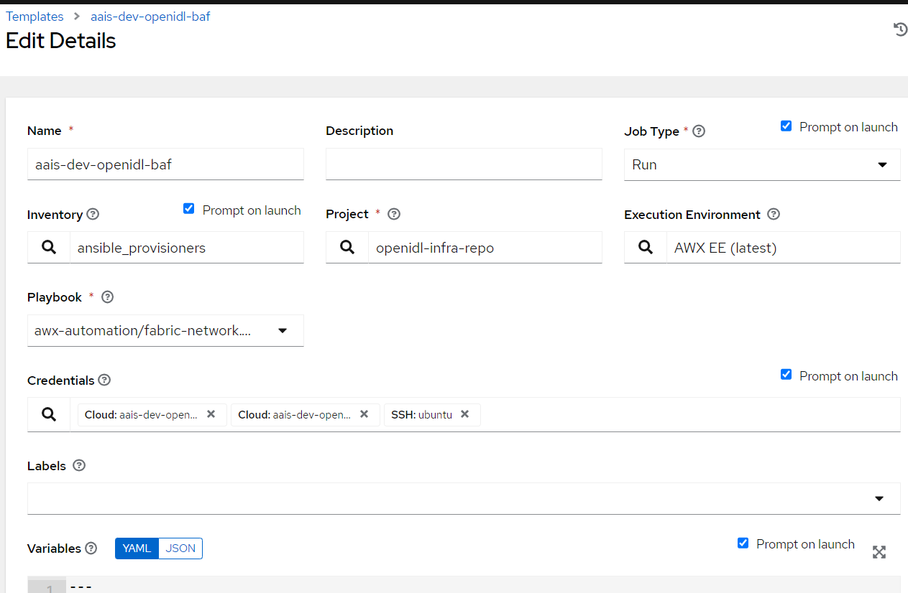

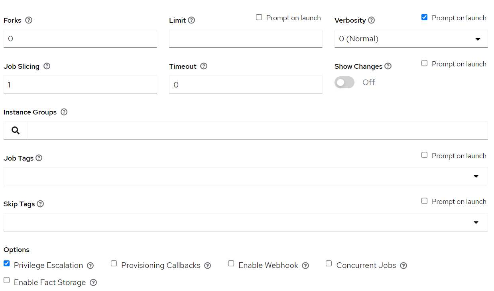

Register Users 
~~~~~~~~~~~~~~

1. Login to Ansible Tower/AWX, Go to Resources => Templates => Add

2. Key in Job name. The format is
   <org_name>-<env>-openidl-register-users

..

   **Org_name:** First 4 characters of org_name. Note Jenkins pipeline
   code refers to the job template name and hence it is vital.

   **Env:** dev \| test \| prod

3.  Select Job type as Run and check on Prompt on Launch

4.  Choose inventory as ansible_provisioners which was configured in
    previous step.

5.  Choose the project that holds the IaC code. (openidl-aais-gitops)
    configured in previous step

6.  Choose the relevant execution environment

7.  Choose the playbook “awx-automation/pre-register-users.yml”.

8.  Choose the following credentials.

    a. Machine credential configured in previous step

    b. OpenIDL-IAC credential configured in previous step

9.  Choose prompt on Launch for variables (mandatory)

10. Set relevant verbosity level, Timeout at minimum 900 seconds.

11. Set the Option “Privilege Escalation”.

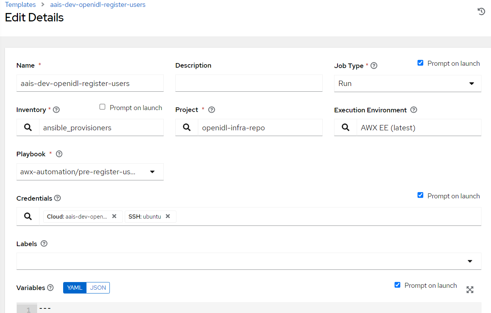

.. image:: images3/image51.png

OpenIDL Application Install 
~~~~~~~~~~~~~~~~~~~~~~~~~~~

1. Login to Ansible Tower/AWX, Go to Resources => Templates => Add

2. Key in Job name. The format is <org_name>-<env>-openidl-apps

..

   **Org_name:** First 4 characters of org_name. Note Jenkins pipeline
   code refers to the job template name and hence it is vital.

   **Env:** dev \| test \| prod

3.  Select Job type as Run and check on Prompt on Launch

4.  Choose inventory as ansible_provisioners which was configured in
    previous step.

5.  Choose the project that holds the application code. (openidl-main)
    configured in previous step

6.  Choose the relevant execution environment

7.  Choose the playbook “awx-automation/deploy-openidl-apps.yaml”.

8.  Choose the following credentials.

    a. Machine credential configured in previous step

    b. OpenIDL-APP credential configured in previous step

9.  Choose prompt on Launch for variables (mandatory)

10. Set relevant verbosity level, Timeout at minimum 900 seconds.

11. Set the Option “Privilege Escalation”.

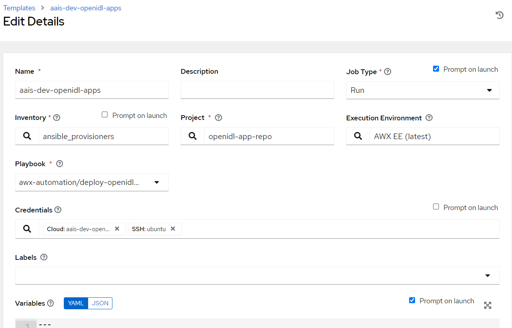

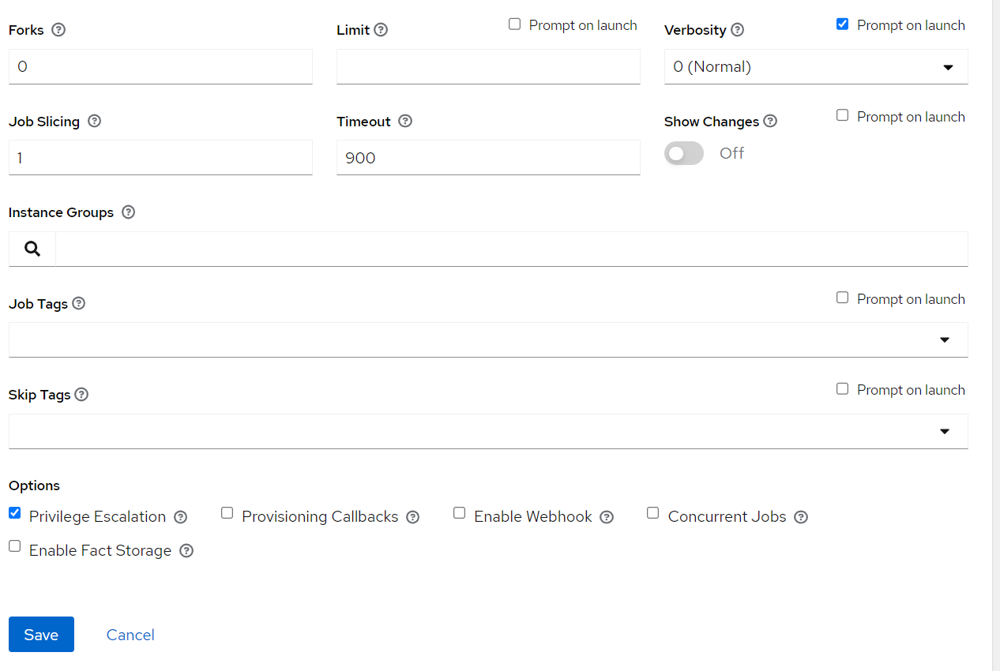

OpenIDL Application Secrets Install 
~~~~~~~~~~~~~~~~~~~~~~~~~~~~~~~~~~~

1. Login to Ansible Tower/AWX, Go to Resources => Templates => Add

2. Key in Job name. The format is <org_name>-<env>-openidl-secrets

..

   **Org_name:** First 4 characters of org_name. Note Jenkins pipeline
   code refers to the job template name and hence it is vital.

   **Env:** dev \| test \| prod

3.  Select Job type as Run and check on Prompt on Launch

4.  Choose inventory as ansible_provisioners which was configured in
    previous step.

5.  Choose the project that holds the application code. (openidl-main)
    configured in previous step

6.  Choose the relevant execution environment

7.  Choose the playbook “awx-automation/deploy-openidl-secrets.yaml”.

8.  Choose the following credentials.

    a. Machine credential configured in previous step

    b. OpenIDL-APP credential configured in previous step

9.  Choose prompt on Launch for variables (mandatory)

10. Set relevant verbosity level, Timeout at minimum 900 seconds.

11. Set the Option “Privilege Escalation”.

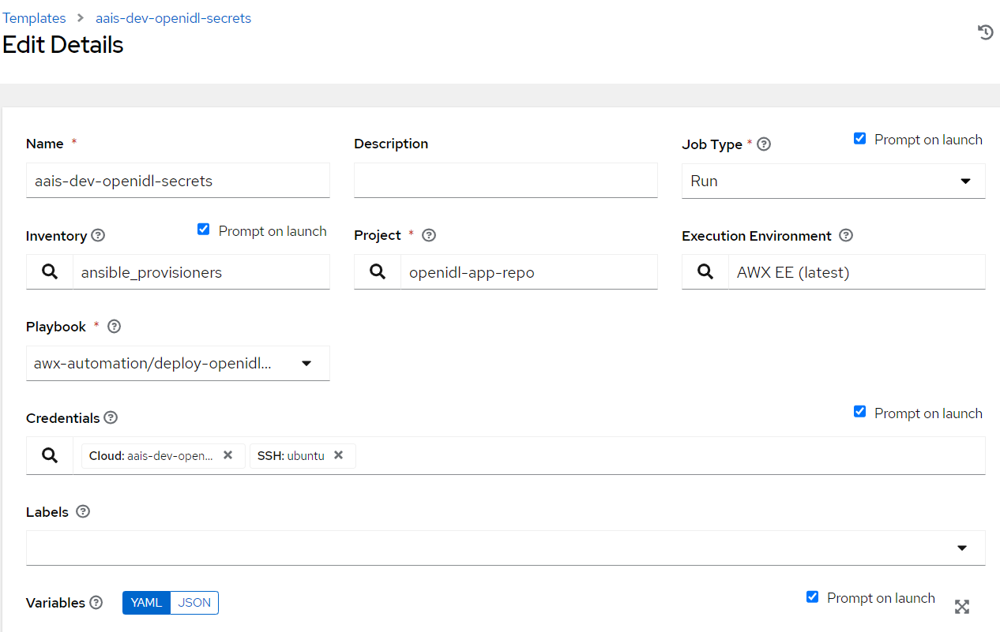

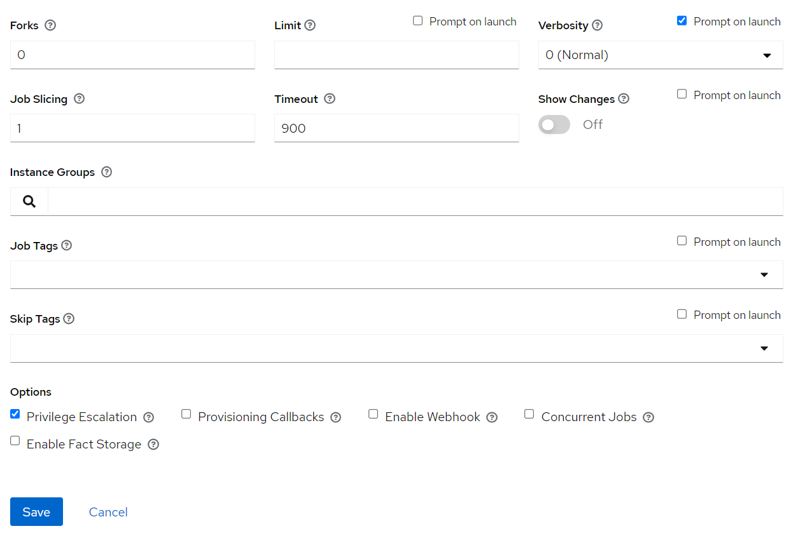

Jenkins Job Configuration
=========================

Credentials
-----------

1. Before configuring Jenkins’s job ensure that the required credentials
   relevant to the jobs are already configured in Jenkins.

..

   Terraform credentials

   AWX (Ansible Tower/AWX User credentials)

   GitHub User credentials

+----+------------+------------+----------+-------------+-------------+
| No | Cred Type  | **ID**     | Username | Password    | Descr       |
+====+============+============+==========+=============+=============+
| 1  | Username   | openidl-a  | GitHub   | Personal    | GitHub      |
|    | with       | ais-gitops | account  | access      | credentials |
|    | password   |            | username | token       |             |
|    |            |            |          | created     |             |
+----+------------+------------+----------+-------------+-------------+
| 2  | Username   | AWX        | Ansible  | Ansible     | Ansible     |
|    | with       |            | tower    | tower user  | Tower/AWX   |
|    | password   |            | username | password    | credentials |
+----+------------+------------+----------+-------------+-------------+
| 3  | Secret     | TF_BE      | NA       | Terraform   | Terraform   |
|    | text       | ARER_TOKEN |          | user/team   | Cloud       |
|    |            |            |          | API token   | /Enterprise |
|    |            |            |          |             | access      |
|    |            |            |          |             | token       |
+----+------------+------------+----------+-------------+-------------+

**References: GitHub credential**

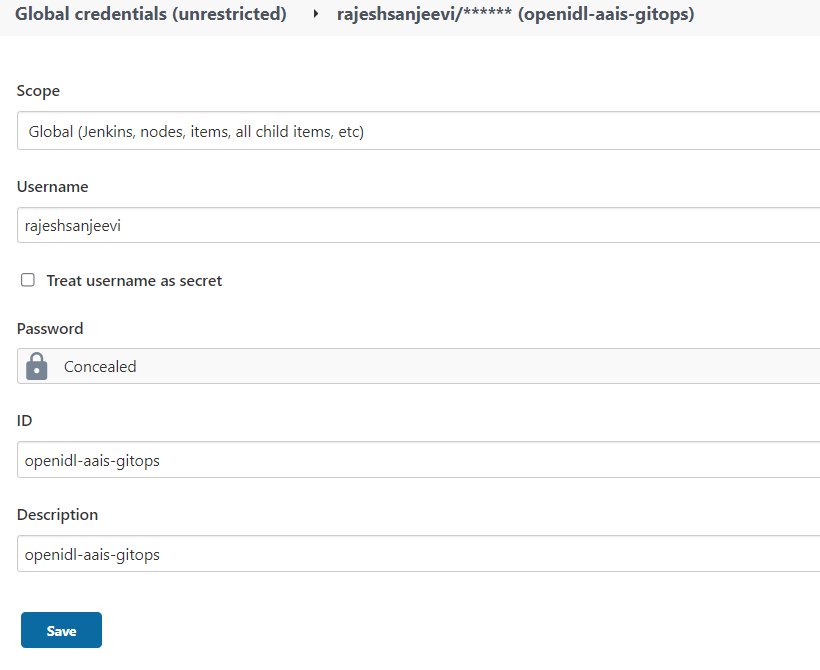

**References: AWX credential**

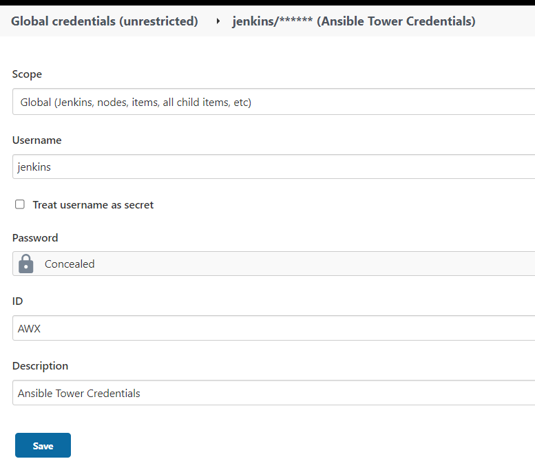

**References: Terraform credential**

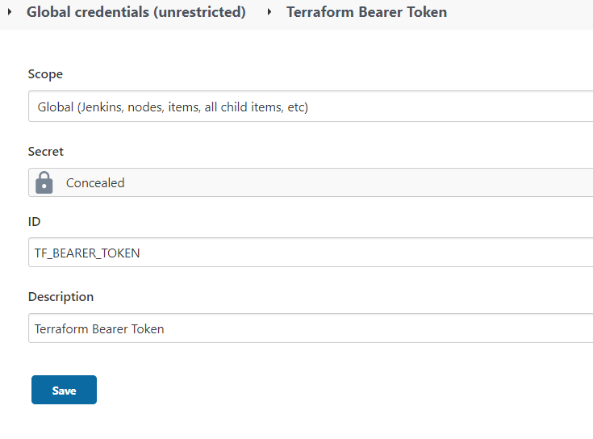

Job Configurations 
------------------

The list of jobs to be configured are

1. Job to provision AWS resources and K8s resources using Terraform
   Cloud/Enterprise

2. Job to provision Vault using Ansible Tower/AWX

3. Job to provision Blockchain Network using Ansible Tower/AWX

4. Job to provision MongoDB using Ansible Tower/AWX

5. Job to provision OpenIDL application secrets and application using
   Ansible Tower/AWX

Terraform Job
~~~~~~~~~~~~~

1. Go to Jenkins => New Item => Give a meaningful name

2. Select Job type as PIPELINE and proceed next

3. Give a description to the job and move to pipeline section

4. Select Definition as Pipeline Script from SCM

5. Select SCM as Git

6. Key in the Infrastructure code repository (openidl-aais-gitops) url.

7. Select the GitHub credentials

8. Specify the relevant branch “refs/heads/<branch-name>”.

9. Set script path to “Jenkins-jobs/jenkinsfile-tf”.

..

   .. image:: images3/image59.png

Vault Job
~~~~~~~~~

1. Go to Jenkins => New Item => Give a meaningful name

2. Select Job type as PIPELINE and proceed next

3. Give a description to the job and move to pipeline section

4. Select Definition as Pipeline Script from SCM

5. Select SCM as Git

6. Key in the Infrastructure code repository (openidl-aais-gitops) url.

7. Select the GitHub credentials

8. Specify the relevant branch “refs/heads/<branch-name>”.

9. Set script path to “Jenkins-jobs/jenkinsfile-vault”.

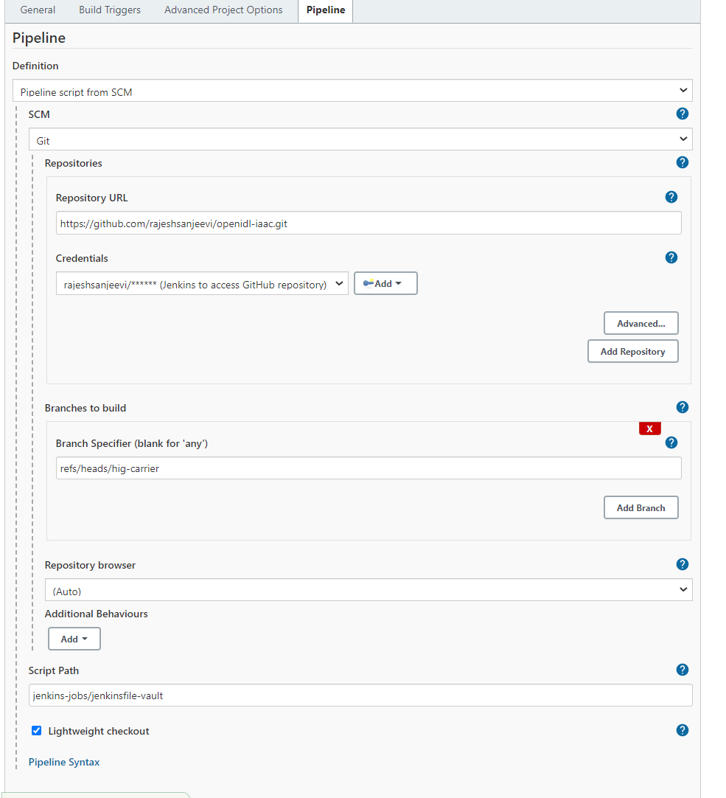

Blockchain Network Job
~~~~~~~~~~~~~~~~~~~~~~

1. Go to Jenkins => New Item => Give a meaningful name

2. Select Job type as PIPELINE and proceed next

3. Give a description to the job and move to pipeline section

4. Select Definition as Pipeline Script from SCM

5. Select SCM as Git

6. Key in the Infrastructure code repository (openidl-aais-gitops) url.

7. Select the GitHub credentials

8. Specify the relevant branch “refs/heads/<branch-name>”.

9. Set script path to “Jenkins-jobs/jenkinsfile-baf”.

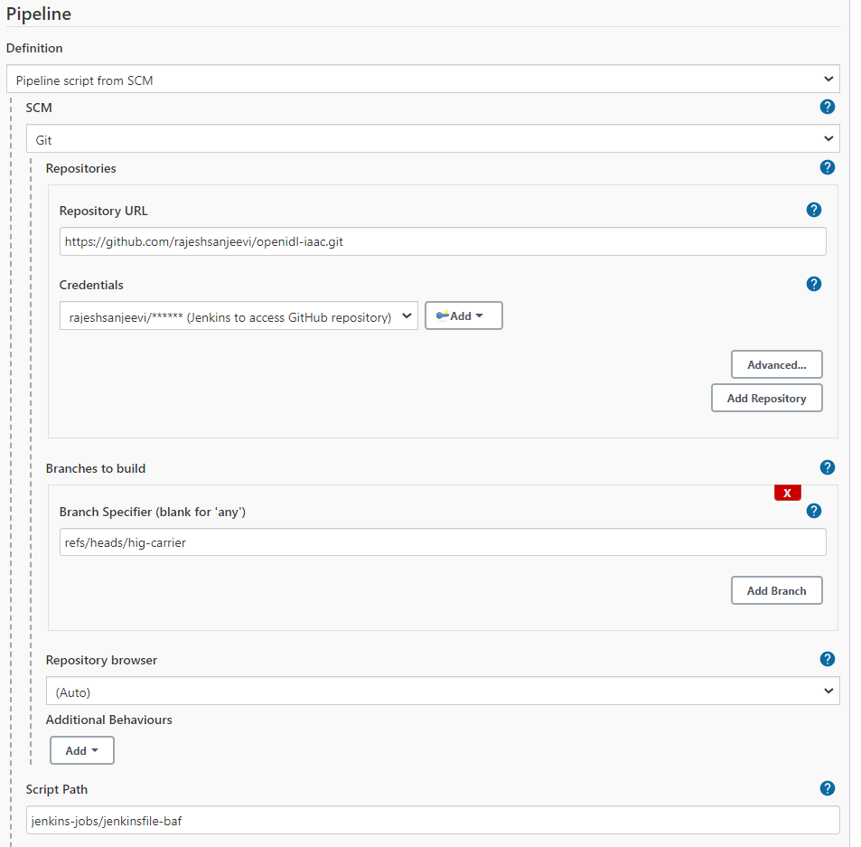

MongoDB Job 
~~~~~~~~~~~

1. Go to Jenkins => New Item => Give a meaningful name

2. Select Job type as PIPELINE and proceed next

3. Give a description to the job and move to pipeline section

4. Select Definition as Pipeline Script from SCM

5. Select SCM as Git

6. Key in the Infrastructure code repository (openidl-aais-gitops) url.

7. Select the GitHub credentials

8. Specify the relevant branch “refs/heads/<branch-name>”.

9. Set script path to “Jenkins-jobs/jenkinsfile-mongodb”.

..

   .. image:: images3/image62.png

OpenIDL Application Job
~~~~~~~~~~~~~~~~~~~~~~~

1. Go to Jenkins => New Item => Give a meaningful name

2. Select Job type as PIPELINE and proceed next

3. Give a description to the job and move to pipeline section

4. Select Definition as Pipeline Script from SCM

5. Select SCM as Git

6. Key in the Infrastructure code repository (openidl-main) url.

7. Select the GitHub credentials

8. Specify the relevant branch “refs/heads/<branch-name>”.

9. Set script path to “Jenkins-jobs/jenkinsfile-apps-secrets”.

.. image:: images3/image63.png

Executing Jenkins Pipeline
==========================

Terraform Job
-------------

This is the job previously setup. It is used to provision AWS resources
and K8s resources. Before trigging the pipeline ensure the following are
setup.

1. Terraform Cloud/Enterprise (Workspaces, VariableSet, API Token)

2. Jenkins (Credentials, Job configuration)

3. Terraform code changes and pushed to repository

**Note**: First run after configuring the job is dummy run as the option
shows as “Build Now”. This will fail and will update your job with
relevant parameters required for the job to run. Further runs will show
an option Build with Parameters which will be right run.

1. To trigger the job, go to Jenkins => relevant job => Build with
   Parameters.

2. Enter the values to the inputs as listed below.

+-----------------+----------------------------------------------------+
| **Field**       | **Description**                                    |
+=================+====================================================+
| TF_ADDRESS      | Terraform Cloud/Enterprise endpoint                |
+-----------------+----------------------------------------------------+
| TF_ORG_NAME     | Organization name setup in Terraform               |
+-----------------+----------------------------------------------------+
| T               | Terraform workspace name setup specifically for    |
| F_AWS_WORKSPACE | AWS resources                                      |
+-----------------+----------------------------------------------------+
| T               | Terraform workspace name setup specifically for    |
| F_K8S_WORKSPACE | K8s resources                                      |
+-----------------+----------------------------------------------------+
| GITHUB_URL      | GitHub repository to check out the code            |
+-----------------+----------------------------------------------------+
| GITHUB_BRANCH   | GitHub branch specifically to check out the code   |
+-----------------+----------------------------------------------------+

3. The job runs terraform plan and asks manual confirmation before
   running terraform apply. This job will run first to provision AWS
   resources and further run for K8s resources. Hence twice it asks
   input to confirm before performing terraform apply.

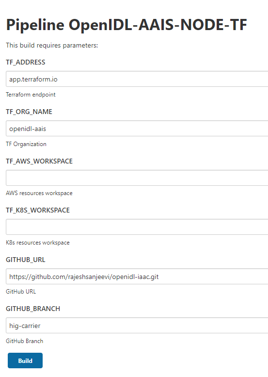

**NOTE:**

It is noticed that sometimes the request to upload configuration data
(git repository content) to Terraform fails with below HTTP error 422.
In case when you see the pipeline failed with this error, rerun the
pipeline which will help.

+----------------------+-----------------------+-----------------------+
| **Status**           | **Response**          | **Reason**            |
+======================+=======================+=======================+
| 422                  | JSON API error object | Malformed request.    |
+----------------------+-----------------------+-----------------------+

Preparing Config file for Infra Job
-----------------------------------

For the following pipelines the configuration file should be prepared
and uploaded to the specific directory in the repository before
triggering the pipeline.

1. Vault

2. MongoDB

3. Blockchain Network

The template and example configuration files are in the repository under
“awx-automation/config-references”. Using these templates, the actual
config file can be created and placed in the path
“awx-automation/config”. The file name should follow the naming standard
as below.

Name: <org-name>-config-<env>.yml

Org-name: First 4 characters of the org name

Env: dev \| test \| prod

The configuration file should be placed in the path
“awx-automation/config/<org-name>-config-<env>.yml.

**NOTE:** The details in preparing the config file are to refer from
base document.

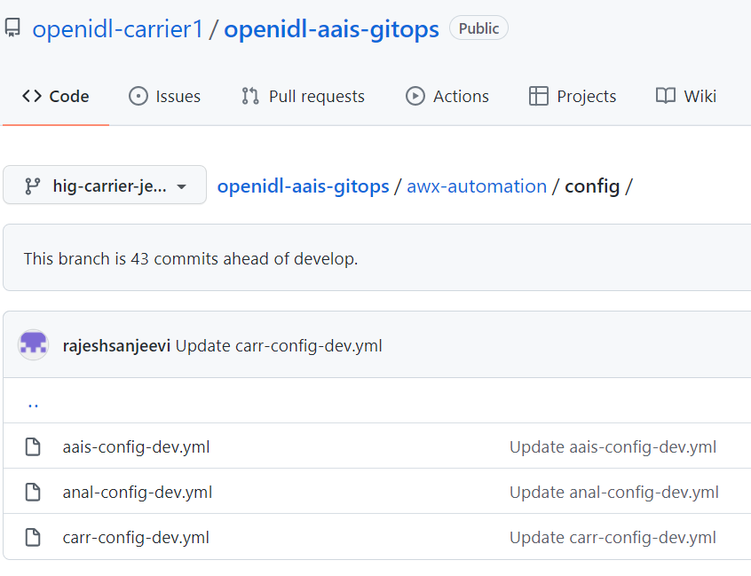

.. _vault-job-1:

Vault Job
---------

To run a vault job, go to specific Jenkins Job and click on Build with
Parameters and key in organization name and environment type (dev \|
test \|prod) and choose deploy_action whether vault-deploy/vault-clean
up based on the typical action to take.

**Note**: First run after configuring the job is dummy run as the option
shows as “Build Now”. This will fail and will update your job with
relevant parameters required for the job to run. Further runs will show
an option Build with Parameters which will be right run.

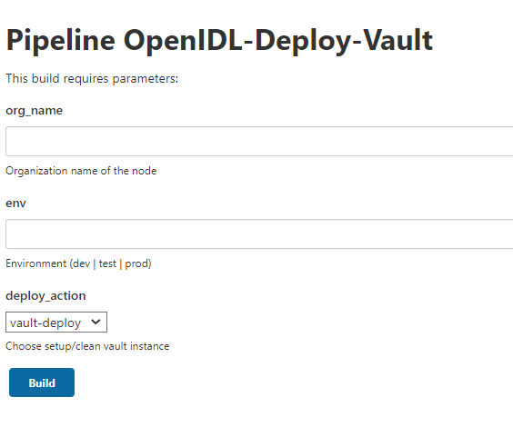

.. _blockchain-network-job-1:

Blockchain Network Job
----------------------

To run blockchain relevant tasks, go to the Job created for Blockchain
Network and trigger relevant actions following the base document.

**Note**: First run after configuring the job is dummy run as the option
shows as “Build Now”. This will fail and will update your job with
relevant parameters required for the job to run. Further runs will show
an option Build with Parameters which will be right run.

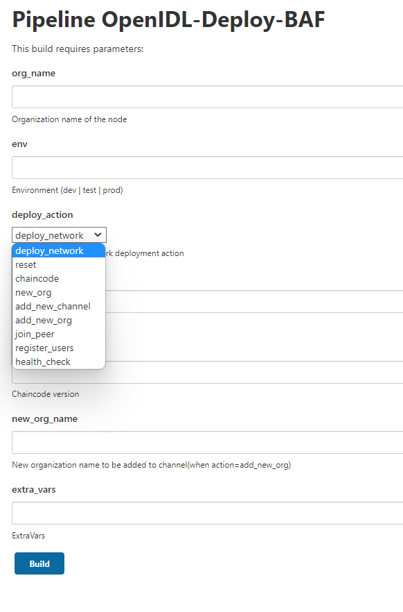

follow the :ref:`Manage the Network` section to complete all the steps for whichever node you are creating.

.. _mongodb-job-1:

MongoDB Job 
-----------

To run a mongoDB job, go to specific Jenkins Job and click on Build with
Parameters and key in organization name and environment type (dev \|
test \|prod) and choose deploy_action whether
mongoDB-deploy/mongoDB-clean up based on the typical action to take.

**Note**: First run after configuring the job is dummy run as the option
shows as “Build Now”. This will fail and will update your job with
relevant parameters required for the job to run. Further runs will show
an option Build with Parameters which will be right run.

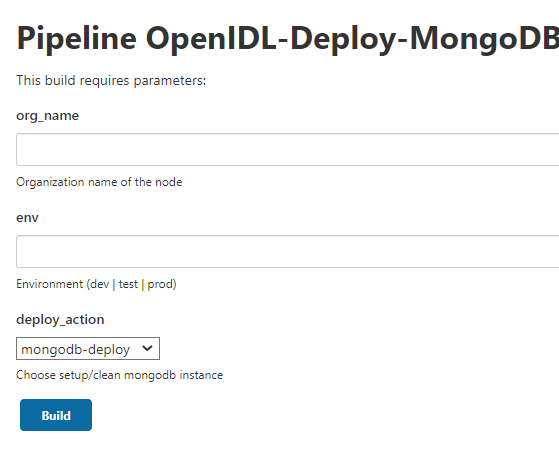

Preparing Config files for OpenIDL application job
--------------------------------------------------

Before running application, specific jobs ensure that the following
actions are completed referring to base document.

1. Credentials in AWX specific to application and secrets job templates

2. Referring to the base document getting the application related config
   json files to vault

3. Referring to the base document getting the application relate
   global-vaules-<org-name>.yml files under “openidl-main/openidl-k8s”
   directory in the repository.

..

   **NOTE:** The global-values- .yml files should follow the naming
   standard as below.

   **NAME:** global-vaules-<org-name>.yaml. The org-name should be
   4-character representation only.

4. The details about how to prepare the file to be referred from base
   document.

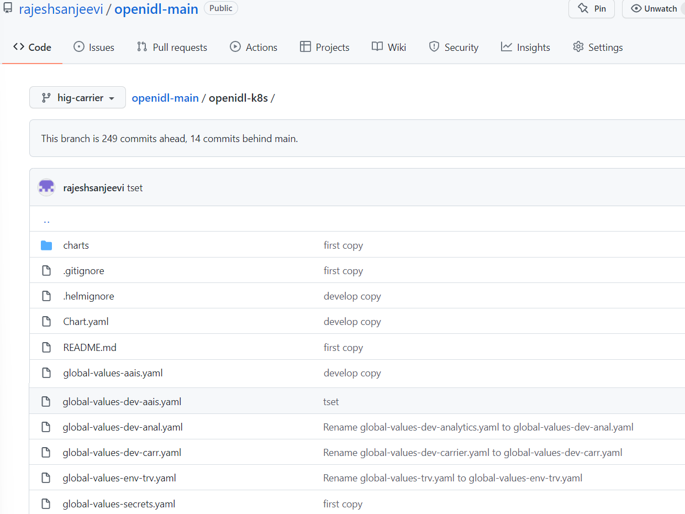

.. _openidl-application-job-1:

OpenIDL Application Job 
-----------------------

To deploy application secrets and OpenIDL application, run the job
configured for OpenIDL applications. Go to Jenkins and select the
relevant job and use Build with Parameters.

**Note**: First run after configuring the job is dummy run as the option
shows as “Build Now”. This will fail and will update your job with
relevant parameters required for the job to run. Further runs will show
an option Build with Parameters which will be right run.

This job has two step process. First perform deploy-secrets and then
deploy-apps action. The first action deploys relevant configuration as
Kubernetes secrets and the next action deploys OpenIDL application
containers.

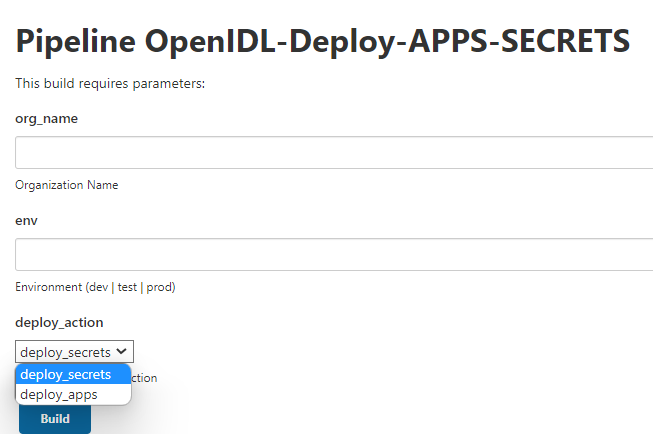

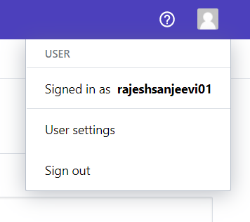
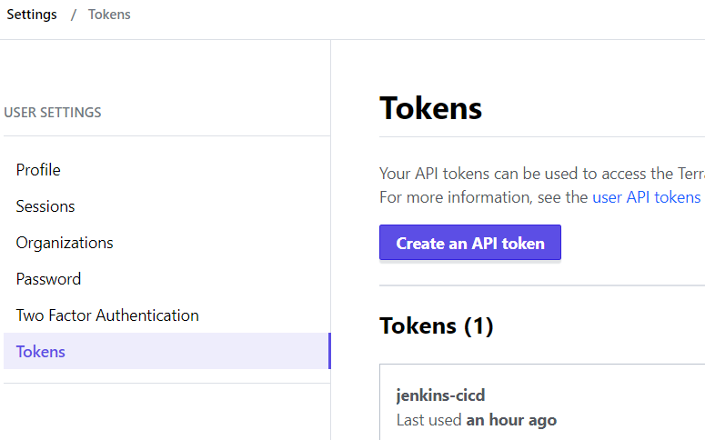

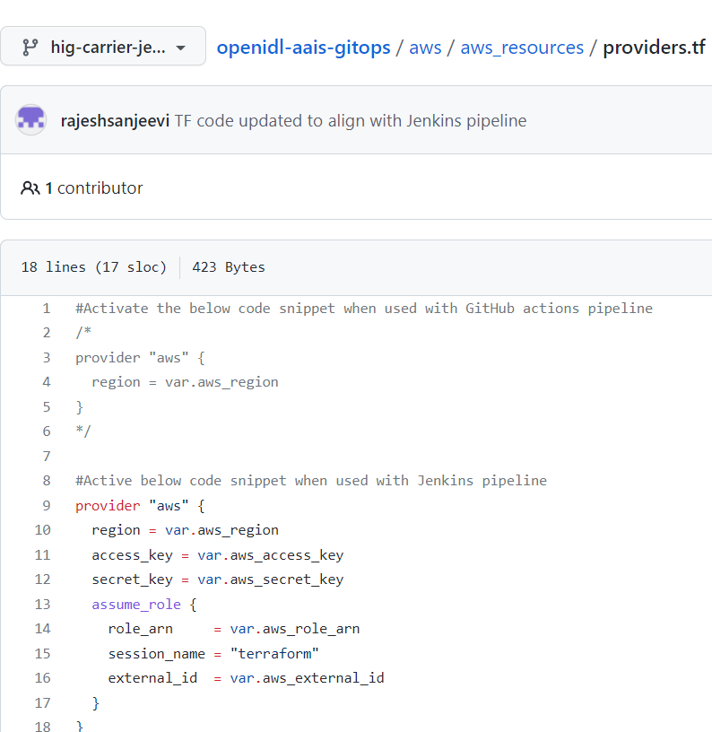
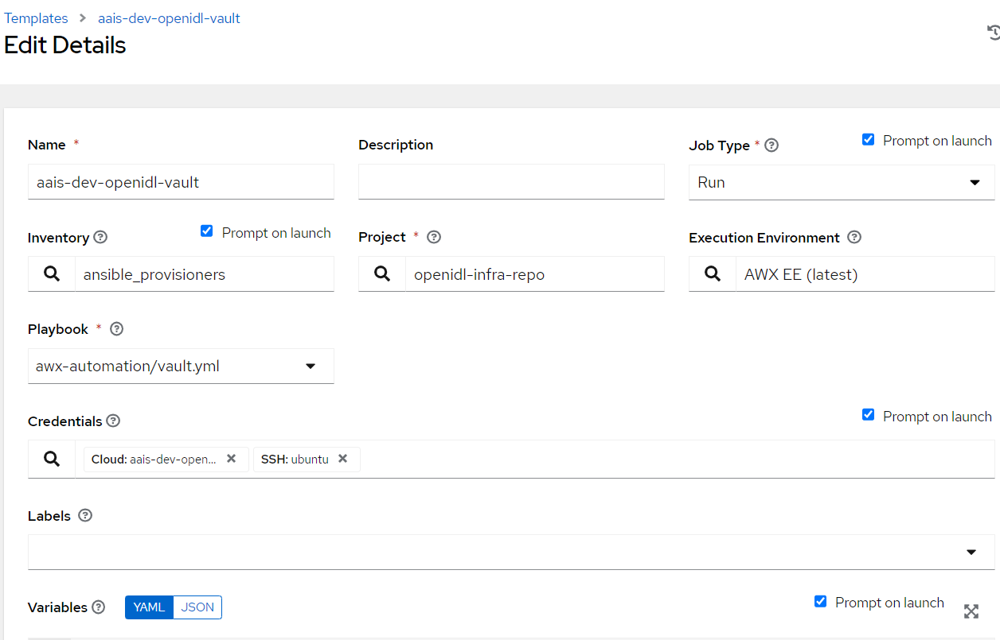
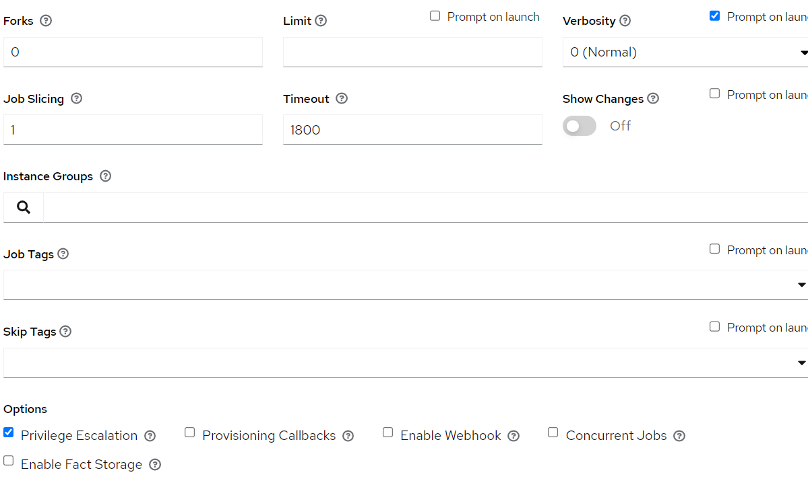
