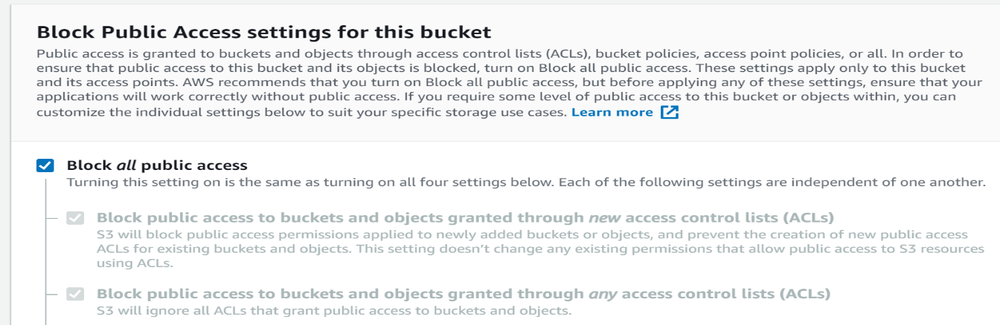

Testing
=======

Use this :download:`Worksheet <./Testing-Worksheet.xlsx>` to manage a test.

Testing Script
--------------

.. csv-table:: Testing Script
    :file: testing-script.csv
    :header-rows: 1

3. Upload Data

5. Consent to the Data Call

Assume each of the roles
------------------------

1. Regulator – regulator

2. State Agent – stat-agent

3. Carrier – carrier

Execute the functions on the different nodes
--------------------------------------------

1. AAIS Node

2. Analytics Node

3. Carrier Node

.. _section-1:

Table of Testing Scenarios
--------------------------

.. csv-table:: Testing Scenarios
    :file: table17.csv
    :header-rows: 1

.. _section-2:

Create a User
-------------

The valid roles are “regulator”, “carrier”, “stat-agent”.

For the aais node you will want to create all three kinds.

For the analytics node, only create the stat-agent and regulator roles.

For the carrier node, only create the carrier role.

NOTE: make sure the carrierId matches a carrier id of data that is
loaded into the mongodb.

Use the API to create a User
~~~~~~~~~~~~~~~~~~~~~~~~~~~~

Role: Administrator

1. Open the swagger ui for the utilities and login to get a token

2. Open the swagger ui for the insurance data manager and authorize with
   the token

3. Open the “app Create User” request.

4. Try it and then fill in the sample data and execute

5. You should now be able to login with that user.

Login
-----

Role: Any

1. For the different environments, there are different users.

2. Depending on the type of node, there are different kinds of users.

3. Login with the credentials created above.

Create a Data Call
------------------

Role: Regulator

1. Open the data call app (openidl-ui) for the node. (do this on the
   aais or analytics node)

2. Login as the specified user whose role should be “regulator”.

3. Click on “New Data Call” in the top right.

4. Enter all required information.

5. Click on save as draft or issue.

   a. If saved as draft, confirm it shows in the draft list

   b. If issued, confirm it shows in the issued list

Issue a Data Call
-----------------

Role: Regulator

1. Login as a regulator

2. Select a data call from the drafts list

3. Click on issue

4. Confirm that it shows in the issued list now

Upload Data
-----------

Role: Carrier

1. Use the swagger ui for the insurance data manager to load data

2. Confirm that the data gets loaded into the mongo database

Create an Extraction Pattern
----------------------------

Role: Administrator

Extraction patterns are used to extract data from the harmonized data
store and make it available on the analytics node.

A schema is available that documents the extraction pattern json format.

Find it in the openidl-extraction-pattern-developer directory in the
openidl-main project in git.

The value of the viewDefinition.map and viewDefinition.reduce elements
is javascript and should work as part of a map reduce in mongo. This can
be tested using the openidl-extraction-pattern-developer tool. Look into
the test cases to see how this can be done.

Create and test the extraction pattern document

1. Create a sample file for the input data.

   a. There are two options for this, use the mapper or copy from mongo

      i.  Use the mapper

          1. the openidl-mapper is included in the dependencies

          2. check out the test-mapper.js for how to run it

          3. you can use the generateSampleData.js to create

             a. run ‘make generate_data’

      ii. Copy data from a known mongodb

          1. Open mongo client

          2. Go to collection

          3. Select the items and “view as text”

          4. Copy into a text file named inputMongoText.txt in the
             “process” folder

          5. Run the utility “convertMongoTextToJson.js” npm run
             convertMongoTextToJson

          6. Grab the valid json from the ouputMongoJson.json in the
             “processed” folder

   b. Paste it into a file in the test/data directory

2. Create a javascript file with the map and reduce functions you want

3. Create a test that points to that above test data for input – copy
   from an existing one to get the pattern

4. Require your file with the map and reduce to get those functions to
   build the extraction pattern

5. Push the extraction pattern to an output file you can use in the
   follow on steps to publish into openidl

6. Run the tests to make sure your expectations pass

Update an Extraction Pattern
----------------------------

Follow the same steps to create an extraction pattern except, when
publishing use the update existing extraction pattern api instead of the
create new.

Publish the extraction pattern to the openIDL
---------------------------------------------

Role: Administrator

1. Using the data call app api we’ll put the extraction pattern into the
   system

2. Open the api-docs for the data call app = data-call-app-base-url +
   /api-docs/ (see below to get the base url)

3. Authorize as defined in 11.4.7.5

4. Authorize with a token from the postman request for the token for the
   resource group

5. Open the create data call service in the swagger screen (if updating
   existing, use the update api instead)

6. Click on try it out

7. Paste the text of the extraction pattern into the example value

8. Click on execute

9. You should receive an ok result with success true

   a. If there are errors then look into the logs for the data call app,
      it should tell you why the endorsement failed, usually it is
      something wrong with the format of the extraction pattern

Assign the extraction pattern to a data call
--------------------------------------------

Role: Stat-Agent

1. log into the application as a stat agent

2. open the data call

3. set the extraction pattern to what you want

Like or Unlike a Data Call
--------------------------

Role: Carrier

1. log into the application as a carrier

2. open a draft data call

3. click on the like data call

4. go back to the list of draft data calls

5. the data call should have one more like (you may need to refresh the
   page)

6. go back into the data call

7. unlike the data call

8. go back to the list

9. the data call should have one less like (you may need to refresh the
   page)

View Organizations that Have Liked a Data Call
----------------------------------------------

You may need to log out of the application and log back in then go to
the draft data call to see the link appear.

Role: Carrier

1. Log in to the application

2. Open a draft data call

3. Next to the likes, click the “View Organizations” link.

4. A list of organizations appears.

View Organizations that Have Consented to a Data Call
-----------------------------------------------------

Role: Regulator

1. Log into the application

2. Open an issued data call

3. Click on the “View Carriers” link next to the Carrier Consents count.

Consent to the data call
------------------------

Role: Carrier

1. Log into the application

2. Open an issued data call

3. Click on “Consent to the Report”

4. The “Consent Recorded:” field should update with current date and
   time.

5. Go back to the list of data calls, this one should have another
   consent.

6. Check the mongo database for a new collection created by the
   extraction pattern execution. It will be for the specific carrier
   with a generated suffix identifier.

7. Confirm the analytics node gets the data as expected

8. Something should show up in the aws s3 bucket

   a. The s3 bucket is openIDL-analytics

   b. There could multiple files based on the extraction pattern

   c. Make sure that there is the appropriate data in the files again
      based on the extraction pattern

Update Chaincode
----------------

From time to time, the chaincode needs to change. To deploy to the node,
run the toolchain after checking into

All nodes should be updated together to make sure they all have the same
chaincode. Run each.

You may need to change the version in the configuration of the BUILD
stage.

The actual process should be
----------------------------

consent at date x

data call is at date y

load data at time of y

is there some kind of window of time to allow data to be captured

like in draft

consent

analytics node should be looking through the data calls to find the
finished data calls and firing the extraction at that time

each carrier node polls to know when to run the extraction pattern

the movement of data into s3 should not happen

Testing Utilities
-----------------

Sharing Access Credentials
^^^^^^^^^^^^^^^^^^^^^^^^^^

A best practice is never to commit credentials to git. To get around
this for our test environments, we keep the credentials in a box folder.
openIDL_environments. Make a sub folder for your environment and node in
the same way you named the resource group.

Data Call Helpers
~~~~~~~~~~~~~~~~~

TODO: Verify

In the course of testing the application, many elements need to be
repeated many times. This can and should be done using the UI to verify
that the UI is working correctly. To facilitate rapid testing of the
api’s however, it is advantageous to be able to execute the
functionality from a command line. The data-call-app has some testing
utilities to create and consent to data calls.

Use one of the following:

node test/api/api-create-data-call.js

node test/api/api-consent-to-data-call.js

node test/api/api-create-and-consent-to-data-call.js

Make sure to update the data call information before running these.

Viewing the MongoDB for testing purposes
~~~~~~~~~~~~~~~~~~~~~~~~~~~~~~~~~~~~~~~~

The mongo database is available in the cloud

See section useDeploy MongoDB for details on connecting to mongo.

Getting the URL for the application
~~~~~~~~~~~~~~~~~~~~~~~~~~~~~~~~~~~

TODO ??

Determining the base URL for an Application
~~~~~~~~~~~~~~~~~~~~~~~~~~~~~~~~~~~~~~~~~~~

TODO ??

Getting Credentials for APIs
~~~~~~~~~~~~~~~~~~~~~~~~~~~~

TODO ??

Debugging a Consent Call
~~~~~~~~~~~~~~~~~~~~~~~~

Trying to follow the path of the consent operation is a complex
undertaking. The flow is something like this:

1. Carrier consents to data call

2. The UI calls the createConsent service in the data-call-app

3. Data call app submits the transaction “CreateConsent” to the ledger
   api

4. The extraction pattern is executed by the data call processor and the
   mongo db is updated with a collection that represents the results of
   the extraction pattern

App Debugging
=============

Checking the logs for the different components
----------------------------------------------

The logs for the different pods can be accessed through kubectl.

Setup aws and configure your eks command to point to the specific
cluster:

something like:

aws *eks* update-kubeconfig --region us-east-1 --name
aais-dev-blk-cluster

Then you can use the usual kubectl commands to get the pods:

kubectl get ns

Then you can get the pods in a namespace

*kubectl* -n aais-net get po

Then you can get the logs for one of the pods and follow it too.

kubectl -n aais-net logs peer0-0 -c peer0

.. _troubleshooting-1:

DNS Troubleshooting
-------------------

If your route53 is incorrect because the domain and subdomain are
incorrect, then follow these steps:

1. Update input file with .com 

2. Delete the hosted zones from Route53 that was created including the
   records and the zones

   1. Delete all but the NS and SOA records, then

   2. Delete the hosted zone

3. Rerun the pipeline AWS_Resources

4. Rerun the pipeline for K8s_Resources

If you get an access denied error in the log for the data-call-app,
rerun the register users baf action.

Alternately, it could be an error in the config file for the channel
name - should be defaultchannel and anal-<organizationName> where the
organizationName must be 4 or less characters.

